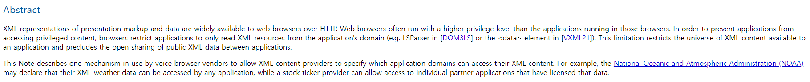
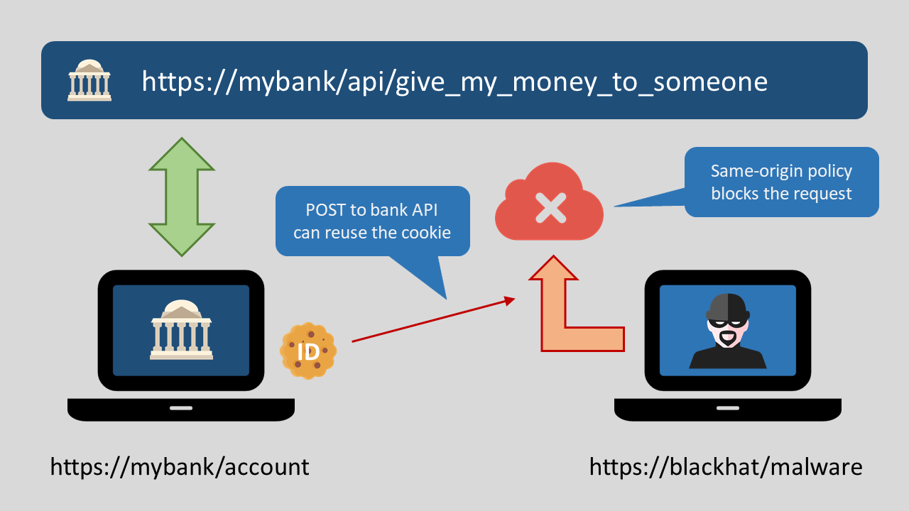
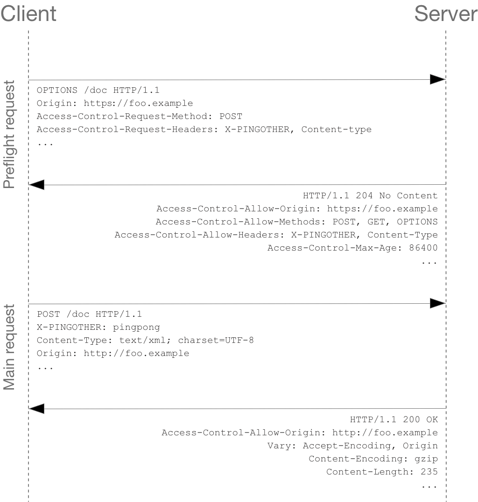
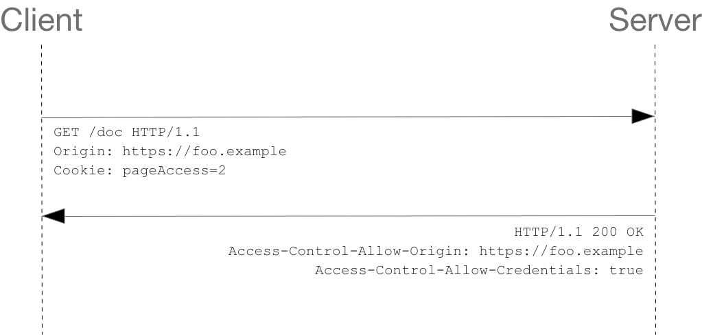

웹 개발을 하다보면, `cors 에러 났다` , `cors 에러 어떻게 해결해?`와 같이 `cors` 라는 것이 정말 많이 언급된다. 오늘은, cors에 대해서 탐구해볼 예정이다.

## 요약

- cors가 무엇인지 알 수 있다.
- cors가 왜 등장하게 되었는 지 알 수 있다.
- sop가 무엇인지 알 수 있다.
- cors가 어떻게 동작하는 지 알 수 있다.
- simple request에 대해서 알 수 있다.
- preflighted request에 대해서 알 수 있다.
- cors 적용 방법에 대해서 알 수 있다.

## cors 정의

아래는, MDN에서 정의한 CORS이다. `http-header based mechanism` 이라고는 하는데, 이게 정확히 무슨 의미인지는 모르겠다.

> **Cross-Origin Resource Sharing** ([CORS](https://developer.mozilla.org/en-US/docs/Glossary/CORS)) is an http-header based mechanism that allows a server to indicate any origins
> (domain, scheme, or port) other than its own from which a browser should permit loading resources.

mechanism이란 단어의 한국어 뜻이 모르겠어서, mechanism의 정의에 대해서 사전에 검색을 해보았다.

> 메커니즘(mechanism)은 사물의 작용 원리나 구조이다. [https://languages.oup.com/google-dictionary-ko/](https://languages.oup.com/google-dictionary-ko/)

이 정의를 차용해서, MDN의 정의를 해석해보면 다음과 같지 않을까 한다. (해석이 많이 매끄럽지는 않다. 더 공부하면서, 한 두 문장으로 CORS를 잘 정의해보도록 하겠다)

`CORS는 서버가 브라우저가 리소스들을 로드할 수 있도록 허용해야하는 다른 오리진(도메인, 스킴, 포트)들을 나타낼 수 있도록 허락해주는 http-header 기반의 작용 원리다.` 여기서, 두 가지 의문 점이 생겼다.

1. 다른 오리진들로부터 리소스를 로드하는 것이 불가능한 건가? 그렇다면, 왜 불가능하게 설계된 걸까?
2. 누가 로드하지 못하도록 막아놓은 걸까?

해당 의문들은, `왜 CORS가 등장하게 되었을까?`를 탐구해보면 해결될 것 같다.

## 왜 CORS가 등장하게 되었을까?

cors의 역사에 대해 검색을 해보다가, 2005년에서 흔적을 찾아볼 수 있었다. 아래는, 서로 다른 오리진과의 요청을 위한 방법을 제시한 proposal의 [Abstract](https://www.w3.org/TR/2005/NOTE-access-control-20050613/) 부분이다.



요약을 해보면 다음과 같다.

> HTTP를 통해서 많은 마크업과 데이터가 웹 브라우저들에게 사용이 가능해지고 있다. 애플리케이션이 권한된 컨텐츠에 접근하는 것을 막기 위해, 브라우저들이 어플리케이션의 도메인의 XML 리소스들만 읽을 수 있도록 제한하고 있는 상황이다. 이러한 제한이 수많은 어플리케이션간의 데이터 교환을 제한하고 있다. 이 문서는, 데이터(XML)을 제공자들이 어떤 어플리케이션의 도메인들이 자신들의 XML 컨텐츠에 접근할 수 있는 지 허락하는 mechanism을 설명하고자 한다.

즉, 같은 도메인의 데이터에만 접근하도록 제한되어 있는 상황에서, 서로 다른 리소스들에게도 접근할 수 있도록 특정 애플리케이션에만 접근을 허용하는 메커니즘이 현재의 CORS이고, 여러 어플리케이션들이 서로 소통하여 더 풍부한 어플리케이션을 제공하기 위해 CORS가 등장했다고 보면 될 것 같다.

## 왜 같은 오리진의 리소스만 접근가능하도록 허용되어있을까?

생각해보면 당연하다. 어느 사용자가 은행 사이트(https://mybank/account)에 접속을 했는데, 어느 해커가 심어놓은 악성 코드로 인해 사용자의 개인정보를 탈취해서, 해커(https://blackhat/malware)의 사이트에서 해당 정보를 이용해서 사용자의 돈을 해커에게 이체할 수도 있기 때문이다.



그렇기 때문에, 신뢰할만한 오리진과의 통신이 권장되는데, 같은 오리진이라면 어느 정도 신뢰될만하다고 생각할 수 있기 때문에, 같은 오리진의 리소스만 접근 가능하도록 했다고 한다. 이것과 관련하여 이미 SOP(Same Origin Policy)라는 정책이 존재한다.

## SOP는 무엇일까?

MDN의 정의는 아래와 같다.

> The **same-origin policy** is a critical security mechanism that restricts how a document or script loaded by one [origin](https://developer.mozilla.org/en-US/docs/Glossary/Origin)
>  can interact with a resource from another origin.

즉, 다른 오리진의 리소스와 상호작용하는 것을 제한하는 보안 방식이라고 이해할 수 있을 것 같다.

`동일한 오리진` , `다른 오리진` 과 같이 오리진이라는 단어가 계속해서 나오고 있다.

**오리진은 무엇일까**

여기 세 개의 오리진이 존재한다. 만약, 서로 리소스를 교환하려고 시도했다면, SOP 정책에 위반하여 제한될 것이다.

1. https://al-bur.github.io/index.html
2. http://al-bur.github.io/index.html
3. http://al-bur.github.io/index.html:3000

오리진은 `scheme(스킴)`, `host(호스트)`, `port(포트)` 의 조합으로, 세 가지 요소가 모두 같아야 같은 오리진이라고 여겨진다.

1번과 2번은 스킴(http vs https)이 달라서 서로 다른 오리진이다. ⇒ SOP 정책에 위반되지 않으려면 하나의 스킴으로 통일해줘야한다.

2번과 3번은 포트(80 vs 3000)가 달라서 서로 다른 오리진다. (포트를 지정해주지 않으면 기본적으로 80 포트를 사용한다.) ⇒ SOP 정책에 위반되지 않으려면 하나의 포트로 통일해줘야한다.

지금까지, SOP와 CORS에 대해서 전반적으로 알아본 것을 한 문장으로 정리해보았다.

`SOP는 다른 오리진의 리소스를 다루는 데 제한을 두는 것이고, CORS는 다양한 리소스들을 활용하기 위해 다른 오리진의 리소스를 다루는 것을 허용하는 메커니즘이다.`

## CORS는 어떻게 동작할까?

CORS, SOP가 무엇을 나타내는 지 알아보았으니, 어떻게 CORS가 동작하는 지 알아볼 차례이다.

`simple request`, `preflighted request`, `credential request`

세 가지 시나리오가 있으므로, 하나씩 소개해보려고 한다. simple request를 이해하기 위해서는 preflighted request에 대한 이해가 전제되어 있어야 하므로, preflighted request에 대해서 먼저, 이야기 해보려한다.

### prefligted request

실제 request를 보내도 안전한 지 체크하기 위해 브라우저가 `options` 메서드를 이용하여 먼저 http request를 보내는 것이 preflighted request이다.

만약, CORS가 잘 적용이 되어있는 서버에게 preflight request를 보내게 되면, 추가적으로, 한 개의 요청을 더 보내는 것이기 때문에, 추가적인 비용을 내면서까지 해야하는 것인지 의문이 들 수도 있다.

<br>

**왜 preflighted request가 생긴 걸까?**

CORS가 적용되어 있지 않은 서버들을 보호하기 위해서이다. CORS가 등장하고 난 후에도, 모든 서버가 CORS에 대한 설정이 되어있지는 않았다. 이러한 서버들을 보호하기위해서, preflight request를 활용하여 먼저 서버가 CORS를 이해하고 핸들링할 수 있는 지 확인을 해주는 역할을 했다고 한다.

이해하기 쉽게 예시를 봐보자

> 1. www.naver.com에서 서버(www.bank.com)에 post 요청을 보낸다
>
> 2. 서버는 요청에 기반하여 작업을 진행한다.
> 3. response를 반환한다.
> 4. 브라우저가 CORS에 관한 헤더가 설정이 되어 있지 않은 것을 확인하고 CORS 에러를 발생시킨다.

이렇게, CORS 관련하여 설정이 제대로 되어있지 않은 서버라면 불필요한 작업을 이미 진행을 한 후 CORS 에러를 만날 수밖에 없다. 만약, DB에 대한 delete 요청이라면, 이후 복잡한 과정을 야기할 수있습니다. 이러한 상황을 대비하기 위해 `preflight`가 존재한다고 보면 될 것 같다.

<br>

**어떻게 CORS가 적용되어 있는 지 판단할 수 있을까?**

아래처럼 preflight request를 보내게 된다. 실제 request에 대한 정보중 일부만을 담아서, 서버에게 보내서 가능한지 확인 절차를 받는 것이다.

```xml
origin: 요청 출처
Access-Control-Request-Method: 실제 요청의 메서드
Access-Control-Request-Headers: 실제 요청의 추가 헤더
```

서버에서는 이에 대한 응답으로 아래의 정보들이 담겨져있는 response를 반환하게 된다.

```xml
Access-Control-Allow-Origin: 서버 측 허가 출처
Access-Control-Allow-Methods: 서버 측 허가 메서드
Access-Control-Allow-Headers: 서버 측 허가 헤더
Access-Control-Max-Age: Preflight 응답 캐시 기간
```

response 헤더에서 중요하게 봐야할 것이 `Access-Control-Allow-Origin`이다. CORS가 어떤 오리진에 대해 적용이 되어 있는 지를 나타내는 헤더라 여기에 요청을 보내온 오리진이 포함이 되어 있어야 브라우저에서 `CORS 에러`를 발생시키지 않게 된다.

예를 들어, client의 오리진이 `www.al-bur.com`인 상황에서, 아래와 같은 응답 헤더가 왔다면, 이제 실제 request를 보낼 차례가 되는 것이다.

```xml
Access-Control-Allow-Origin: www.al-bur.com
```

prefilighted request 성공 이후 request를 보내는 과정을 요약한 그림이다.



여기서 하나의 의문이 생긴다.

모든 크로스 오리진 요청들은 `prefilgithed request`를 꼭 보내야만 하는 것일까?😢

### Simple Request

그렇지 않다. `simple request`인 경우에는 `prefilighted request`를 보내지 않고, `preflighted request` + `실제 request`의 과정을 하나로 합친 것과 같이 동작을 한다.

즉, request를 보내면, 서버가 클라이언트 오리진에 대해 CORS가 적용되어 있는 지 확인을 함과 동시에 요청된 작업까지 수행한다는 의미이다.

두 개의 요청을 하나의 요청으로 줄여서 하나의 네트워크 요청 비용을 줄일 수 있지만, `preflighted request이 등장한 이유`를 놓고 보면 이는 서버에게 위험을 초래할 수도 있는 상황이다. 그렇기 때문에, `simple request`가 가능한 상황들을 한정해 놓은 것 같다.

<br>

**simple request를 사용할 수 있는 조건**

1. GET, POST, HEAD 메서드여야한다.
2. 수동적으로 추가가 가능한 헤더는 Accept, Accept-Language, Content-Language, Content-Type, Range이다.
3. `Content-Type` 헤더의 값이 application/x-www-form-urlencoded, multipart/form-data, text/plain여야 한다.

위의 조건을 충족하는 요청을 보내게 되면, 아래처럼 `preflighted request` 요청이 발생하지 않는 것을 확인할 수 있다.



## CORS를 적용해보자

CORS에 대해서 자세히 알아보았으니, 이제 적용해볼 차례이다.

**Access-Control-Allow-Origin 설정하기**

CORS에 대한 정의에서도 살펴보았듯이, `http-header based mechanism`이다. 즉, http-header에 헤더를 추가해서 CORS에 대한 설정을 해줄 수 있다.

`Access-Control-Allow-Origin`에 허용할 오리진을 명시해주는 것만으로, CORS를 적용해줄 수 있다.서버에서 직접 아래처럼 헤더에 추가만 해주면, 해당 오리진으로부터 오는 요청에 대해 정상적인 응답을 보내줄 수 있게 된다.

```xml
Access-Control-Allow-Origin: https://www.al-bur.com
```

이렇게, 일일이 header를 설정하는 것이 번거롭기 때문에, 여러 백엔드 프레임워크등에서 손쉽게 헤더를 설정해줘서 CORS를 적용해주는 방법이 개발되고 개발자들이 많이 애용하고 있는 상황이다.

## 참고 자료

[이미지 출처](https://darnton.co.nz/2020/07/13/cors-proxy-for-client-side-blazor/)

[https://blog.dataminded.com/cors-and-the-sop-explained-f59de3a5078](https://blog.dataminded.com/cors-and-the-sop-explained-f59de3a5078)
[https://developer.mozilla.org/ko/docs/Web/HTTP/CORS](https://developer.mozilla.org/ko/docs/Web/HTTP/CORS)
