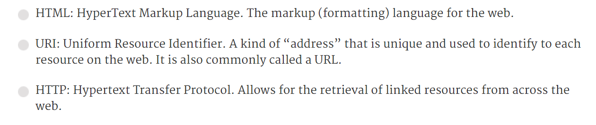
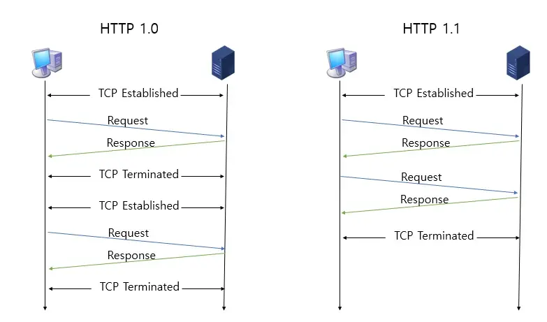
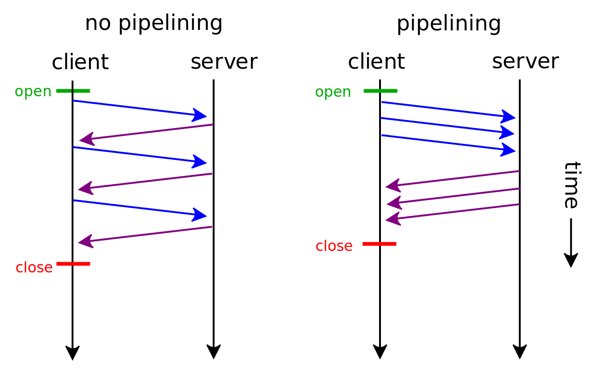

오늘은 HTTP에 대해서 알아보려고 한다. HTTP라는 단어는 웹 개발을 하면서 많이 듣게 되지만, 사실 설명해보라고 한다면 명확이 어떤 것이다라고는 못할 것이다. 이번 포스팅을 통해서 HTTP에 대해서 처음부터 끝까지 탐구해보면서 정확히 HTTP가 무엇인지 알아보자😀

<br>

# HTTP 정의

먼저, HTTP의 정의를 살펴보고자 한다. 아래는, MDN 공식 문서에서 정의한 HTTP이다.

> **_Hypertext Transfer Protocol (HTTP)_**  is an [application-layer](https://en.wikipedia.org/wiki/Application_Layer) protocol for transmitting hypermedia documents, such as HTML. It was designed for communication between web browsers and web servers, but it can also be used for other purposes.

해석을 해보면, HTTP는 HTML처럼 하이퍼 미디어 문서들을 전송하는 데 사용되는 어플리케이션 계층 프로토콜이라고 한다. 브라우저와 서버간의 통신을 위해 사용되도록 설계 되었지만, 다른 목적으로도 사용될 수 있다고 한다.

해석을 해보았지만, 명료하게 HTTP가 무엇인지 와닿지 않는다.

HTTP는 단어들의 조합으로 구성되어 있는 약어이기 때문에, 각 단어가 무슨 의미를 가지고 있는 지를 파악하면 HTTP가 무엇인지 이해하는데 더 도움이 될 것 같다.

**HyperText란?**
다른 문서나 텍스트로 이동할 수 있는 링크를 담고 있는 텍스트

**Transfer란?**
전송

**protocol이란?**
전자 장비(컴퓨터)들 간의 데이터를 전송할 때 지켜야하는 규칙

정리를 해보면, `HTTP는 다른 문서로 이동할 수 있는 링크를 담고 있는 텍스트를 전송하는데 지켜야하는 규칙이라고 해석하면 될까?`

사실, 정의만 보고서는 HTTP가 정확히 어떤 일을 하는 지 와닿지 않는다. 특정한 개념을 이해하기 위해서는 그것이 왜 세상에 등장하게 되었는 지 알아보는 것이 도움이 많이 될 것이다.

<br>

# 왜 HTTP가 등장하게 되었을까?

HTTP라는 단어는 `Tim Berners Lee`라는 컴퓨터 과학자가 World Wide Web이라는 것을 제시했을 때 처음 등장하였다.

아래는 `Tim Berners Lee` 가 기존의 인터넷을 활용한 정보 교환 방식에 대해 불편함을 느끼고, `hypertext`라는 해결방법을 생각해냈다는 인용글을 가져와보았다.

> Scientists come from all over the world to use its accelerators, but Sir Tim noticed that they were having difficulty sharing information.
> *“In those days, there was different information on different computers, but you had to log on to different computers to get at it. Also, sometimes you had to learn a different program on each computer. Often it was just easier to go and ask people when they were having coffee…”,* [Tim says](http://www.w3.org/People/Berners-Lee/Kids.html).
> Tim thought he saw a way to solve this problem – one that he could see could also have much broader applications. Already, millions of computers were being connected together through the fast-developing [internet](http://www.internetsociety.org/internet/what-internet) and Berners-Lee realised they could share information by exploiting an emerging technology called `hypertext`

위의 사건을 이후로, Tim Berners Less는 웹(WWW)이라는 것을 제시하였고 웹을 위한 3가지 기본 기술을 아래와 같이 명시하였다. HTML, URI, 그리고 오늘의 주인공인 HTTP도 그 중 하나라는 사실을 알 수 있다.



<br>

# HTTP의 발전 과정

왜 HTTP가 등장했는지 알아보았으니, 현재까지 어떻게 발전해왔는 지를 봐야할 것 같다. 사실, HTTP 0.9부터 최신 HTTP까지 자세히 알아보려했는데, MDN 문서에 너무나 잘 정리되어 있어서 간단히 작성해보려 한다. (상세한 정보를 원하시는 분들은 MDN을 참고해주세요😀)

[https://developer.mozilla.org/en-US/docs/Web/HTTP/Basics_of_HTTP/Evolution_of_HTTP](https://developer.mozilla.org/en-US/docs/Web/HTTP/Basics_of_HTTP/Evolution_of_HTTP)

## HTTP/0.9(the one-line protocol)

초기 버전의 HTTP는 굉장히 간단했다. 요청은 단 한 줄로 구성되어 있었고 `GET` 메서드만이 사용가능하였다. 서버와 연결이 된 후로는 `full URL`이 필요없었다.

**요청**

```tsx
GET / mypage.html
```

응답 또한 파일 그 자체로 구성되어 있어서 굉장히 간단했다.

**응답**

```tsx
<html>A very simple HTML page</html>
```

이때까지는, HTTP 헤더가 존재하지 않았기 때문에, 오직 HTML 파일들만이 전송가능했다. 상태와 에러 코드 또한 존재하지 않았다.

## HTTP/1.0(the one-line protocol)

HTTP 0.9는 많이 제한적이었지만, 브라우저나 서버가 이를 어느정도 해결해주었다.

- HTTP 버전 정보가 각 요청에 포함되서 전송되었다.
- 응답 시작 부분에 상태 코드를 포함해, 브라우저가 스스로 요청에 대한 성공과 실패를 인식해 이에 따른 행동을 취하도록 해주었다.
- HTTP 헤더라는 개념이 요청과 응답 모두에게 적용되었다.
- `Content-type` 헤더로 인해 HTML 파일 이외의 문서들도 전송이 가능해졌다.

**요청**

```tsx
GET /mypage.html HTTP/1.0
User-Agent: NCSA_Mosaic/2.0 (Windows 3.1)
```

**응답**

```tsx
200 OK
Date: Tue, 15 Nov 1994 08:12:31 GMT
Server: ALBUR/3.0 libwww/2.17
Content-Type: text/html
<HTML>
A page with an image
  
</HTML>
```

## HTTP/1.1(the standardized protocol)

HTTP1.0에 대한 발전과 HTTP 표준화 작업이 동시에 이루어지고 있었다. HTTP/1.0이 나오고 몇 달 지나지 않아, HTTP의 첫 표준화 버전인 HTTP/1.1이 등장하게 되었다.

- 연결을 재사용할 수 있게 되었다. 아래의 그림을 보면, HTTP1.0 같은 경우에는 하나의 요청-응답 세트가 종료되면 TCP 연결을 끝내게 되는데, HTTP/1.1은 한 번의 TCP 연결로 여러 요청-응답 세트의 작업이 이루어질 수 있게 되었다.



- 파이프라이닝이 추가되었다. 첫 번째 응답이 오기전에도 두 번째 요청을 보낼 수 있게 되었다. 이로써, 통신의 대기시간을 줄일 수 있게 되었다.



- cache-control 메커니즘이 도입이 되었다.
- Content negotiation이 도입 됨으로써 클라이언트와 서버는 서로 어떠한 컨텐츠를 교환할 지 상호합의할 수 있었다.
- 같은 IP 주소에 다른 도메인을 호스팅할 수 있게 되었다.

**요청**

```tsx
  GET /en-US/docs/Glossary/Simple_header HTTP/1.1
  Host: developer.mozilla.org
  User-Agent: Mozilla/5.0 (Macintosh; Intel Mac OS X 10.9; rv:50.0) Gecko/20100101 Firefox/50.0
  Accept: text/html,application/xhtml+xml,application/xml;q=0.9,*/*;q=0.8
  Accept-Language: en-US,en;q=0.5
  Accept-Encoding: gzip, deflate, br
  Referer: https://developer.mozilla.org/en-US/docs/Glossary/Simple_header
```

**응답**

```tsx
200 OK
Connection: Keep-Alive
Content-Encoding: gzip
Content-Type: text/html; charset=utf-8
Date: Wed, 20 Jul 2016 10:55:30 GMT
Etag: "547fa7e369ef56031dd3bff2ace9fc0832eb251a"
Keep-Alive: timeout=5, max=1000
Last-Modified: Tue, 19 Jul 2016 00:59:33 GMT
Server: Apache
Transfer-Encoding: chunked
Vary: Cookie, Accept-Encoding
```
