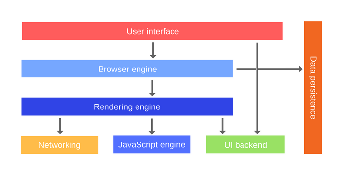
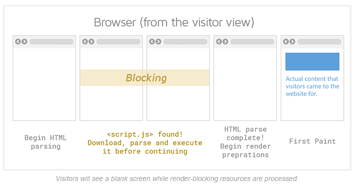

rendering을 차단하는 리소스를 알아보고 이를 해결하는 방법을 이해하기 위해서 먼저, rendering에 대해서 자세히 알아보려한다.

## rendering이란?

rendering이라는 단어는 문맥에 따라 다양한 의미로 해석될 수 있다. 예를 들어, 브라우저에서의 rendering, 리액트에서의 rendering등 웹 개발 세상에서는 다양한 곳에서 rendering이라는 단어가 사용이 되고 있는 것처럼 말이다. rendering이라는 단어의 사전 정의를 검색해보면 아래와 같다.

> **_렌더링이란?_**
>  rendering or image synthesis is the process of generating a photorealistic or non-photorealistic image from a 2D or 3D model by means of a computer program.
>  3차원 공간에 객체(Object)를 2차원 화면인 하나의 장면(Scene)에 바꾸어 표현하는 것을 말한다.

해당 정의는 그래픽 산업에서 사용되는 정의이지만, 크게 정의해보면 `화면에 나타내는 것`이라고 볼 수 있을 것 같다.

웹개발에서의 렌더링을 검색해보자

> **웹 개발에서의 렌더링이란?**
> Rendering is a process used in web development that turns website code into the interactive pages users see when they visit a website. The term generally refers to the use of [HTML](https://www.seobility.net/en/wiki/HTML5), CSS, and JavaScript codes. The process is completed by a **rendering engine,** the software used by a web browser to render a web page. Because of its close association with web browsers, rendering engines are commonly referred to as browser engines. [https://www.seobility.net/en/wiki/Rendering](https://www.seobility.net/en/wiki/Rendering)

- 짧게 요약하자면, 렌더링이란 사용자들이 웹사이트에 접속을 했을 때 상호작용이 가능한 페이지들을 볼 수 있도록 코드(HTML, CSS, javascript)를 페이지로 변환하는 작업이다.
  >

## rendering은 어떻게 이뤄질까?

rendering이 무엇인지 알았으니, 어떠한 과정을 거쳐서 rendering이 일어나는 지 찾아보자

간단하게 보면, 아래의 흐름으로 rendering이 이뤄진다.

1. HTML을 파싱해서 DOM을 만든다.
2. CSS를 파싱해서 CSSOM을 만든다.
3. DOM과 CSSOM을 활용해서 render tree를 만든다.
4. reflow 과정을 거친다.
5. repaint 과정을 거친다.

보다 더 자세한 렌더링 과정은 [https://web.dev/critical-rendering-path-render-tree-construction/](https://web.dev/critical-rendering-path-render-tree-construction/)를 참고😀

## 누가 rendering을 해주는 가?

본격적으로, rendering을 차단하는 리소스가 무엇인지를 찾아보기전에 누가 rendering을 담당하고 있는 지 찾아봐야할 것 같다. 담당자가 누군지 알아야, 그 담당자를 방해하는 리소스들을 찾을 수 있으니 말이다.

아래 이미지는 브라우저를 구성하는 것들을 보여준다.



여기서 rendering engine의 정의를 설명한 인용문을 봐보자

`요청한 컨텐츠를 보여주는 역할을 한다.` 컨텐츠가 HTML이라면, rendering engine은 HTML과 CSS를 파싱하고, 화면에 파싱한 컨텐츠를 보여준다.

> **The rendering engine**: responsible for displaying requested content. For example if the requested content is HTML, the rendering engine parses HTML and CSS, and displays the parsed content on the screen. [https://web.dev/howbrowserswork/](https://web.dev/howbrowserswork/)

\*참고로, 파싱이란, 텍스트 형식의 코드를 브라우저가 사용할 수 있도록 변환하는 작업을 뜻한다. (taking the code we write as text (HTML, CSS) and transform it into something that the browser can work with**_)_**

즉, 이름에서도 알 수 있듯이 rendering engine이 rendering을 담당하고 우리가 흔히 알고 있던 `브라우저 렌더링 과정`은 모두 rendering engine이 담당하고 있었다는 것을 알게 되었다.

## rendering을 차단하는 것은 무슨 의미일까?

`rendering을 차단하는 리소스는 무엇인가요?`라는 질문에서 `rendering을 차단한다는 것`이 무엇을 뜻하는 지 먼저 정의하고 가야할 것 같다.

아래 그림을 보면, 사용자가 rendering이 잠시 차단당하는 웹사이트에 접속했을 때의 시나리오를 보여준다.



사용자가 사이트에 접속하면, rendering engine이 HTML을 파싱한다. 파싱하는 도중에, script 태그를 만나 javascript 파일을 다운로드, 파싱하고 실행하게 된다(script 태그에 비동기 적인 실행에 대한 별다른 attribute가 없다고 가정). javascript에 대한 작업이 모두 끝나고 나면 다시 끝내지 못한 HTML 파싱 작업을 하게 된다. 이후, 나머지의 rendering 과정을 거쳐서 사용자에게 화면을 보여주게 된다.

여기서 만약, javascript 파일을 다운로드 하는 데 10분이 걸렸다고 한다면, 사용자는 페이지에 접속한 지 10분동안 아무것도 보지 못하는 것이다. 그렇게 된다면, 사용자는 사이트를 100% 이탈할 것이다.

사실, javascript를 load해서 DOM과 CSSOM에 변경을 가하는 것도 rendering 과정의 일부이다. 그래서, `rendering을 차단한다는 것`의 의미를 `사용자가 접속했을 때 빠르게 렌더링을 하는 것을 방해하는 것` 이라고 해석하면 좋을 것 같다.

## rendering을 차단하는 리소스는 무엇일까?

`사용자가 접속했을 때 빠르게 렌더링을 하는 것을 방해하는 리소스` 를 찾아보면 대표적으로 `javascript` 와 `css` 가 있을 것이다.

1. javascript

기본적으로 rendering engine은 script 태그를 만나면 html parsing을 멈추고 javascript를 로드하고, 실행을 하게 된다. 위의 예시 처럼, html 코드 중간에 script 태그가 위치한다면, 사용자는 javascript를 로드하고, 실행하는 시간만큼 화면을 늦게 보게 된다.

2. css

javascript에 대한 동기적인 작업과는 다르게, css를 로드하고 cssom을 생성하는 과정은 dom 생성과 병렬적으로 진행된다. 그렇기 때문에, javascript와 같은 방식으로 rendering을 차단하지 않는다. rendering을 위해서는 DOM과 CSSOM을 조합해 만드는 `render tree`가 필요하다. 그러므로, cssom이 늦게 생성되는 만큼 사용자는 화면을 늦게 보게 된다.

아래처럼 같은 화면을 렌더링해주는 두 가지의 코드가 있다. 전자의 코드가 후자의 코드보다 느리게 화면을 렌더링 해줄 것이다. 이유는, link 태그가 더 뒤에 위치해 있기 때문에, css를 로드하고 cssom을 생성하는 것이 더 늦을 수밖에 없기 때문이다.

```html
<body>
  <div>cssom이 늦게 생성되는 것은 렌더링을 늦춘다.</div>
</body>
<link href="style.css" rel="stylesheet" />
```

```html
<head>
  <link href="style.css" rel="stylesheet" />
</head>
<body>
  <div>cssom이 늦게 생성되는 것은 렌더링을 늦춘다.</div>
</body>
```

## 어떻게 rendering을 차단하지 않도록 해줄 수 있을까?

1. javascript

   - dom 생성을 방해하지 않도록 `</body>` 이후에 javascript를 로드하는 `<script>` 태그를 위치시킨다.
   - defer attribute를 적용해준 `<script>` 태그를 `<head>` 태그 내부에 위치시킨다.
     - defer attribute를 적용한 script 태그를 만나게 되면, rendering engine은 병렬적으로 javascript를 로드하고, html 코드를 다 파싱한 이후에 javascript를 실행해준다.

2. css
   - `<head>` 태그 내부에 css를 로드하는 `<link>` 태그를 위치시킨다.
     - 병렬적으로, css 파일이 로딩되고 cssom이 생성되기 때문에, 최대한 빠르게 코드가 실행되도록 해준다.
