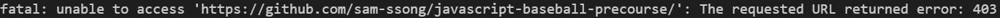

1주차 미션을 진행하다가 드디어 처음으로 로컬에서 작업한 것을 원격 저장소에 push 하려고 했습니다.

하지만 아래와 같은 에러가 발생하게 되었습니다.



찾아보니까 해당 주소에 대한 권한이 없어서 403 에러가 발생한다는 것을 알게되었습니다.

해결방법을 찾아보니 인증을 위해 remote url을 변경해주고 인증을 진행하면 된다고 합니다.

```bash
git remote set-url origin https://YOURUSERNAME@github.com/USERNAME/REPOSITORY.git
```

<br>

<적용 예시>

```bash
git remote set-url origin https://sam-ssong@github.com/sam-ssong/javascript-baseball-precourse.git
```

이대로 하니깐 제대로 push가 되는 것을 확인할 수 있었습니다😀

\*문제는 해결했지만 왜 이러한 문제가 발생했는 지에 대한 근본적인 원인은 아직 찾지 못해서 더 공부해봐야겠습니다!

<br>

[참고] https://beagle-dev.tistory.com/244
