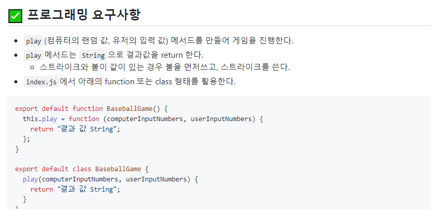
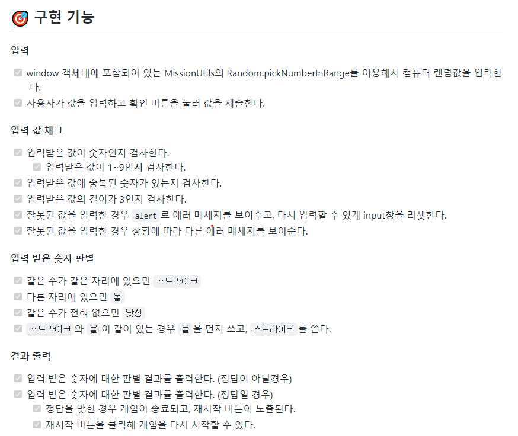
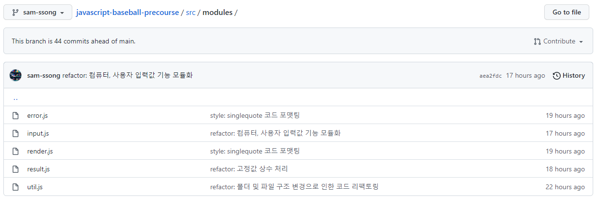
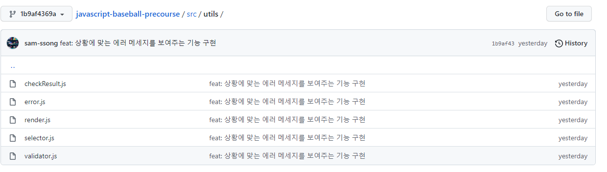
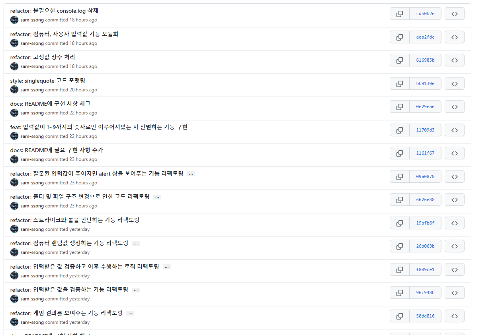

이번 포스팅은 1주 차 미션을 되돌아보기 위한 자아성찰의 목적을 가지고 작성하였습니다.

어제부로 우테코 1주 차 미션이 끝났습니다.

빠른 한 줄평은 `미션 주도 학습은 재밌어`입니다.

지금부터 첫 미션을 받을 때부터 미션 제출을 완료했을 때까지 시간 순서로 회고를 진행해보려고 합니다. 이번 글의 주된 목적은 2주 차를 시작하기 전 제 자신을 되돌아보는 목적의 글이니 글 내용과 구성이 중구난방일 수도 있다는 점 참고 부탁드립니다😃

회고이다 보니 좀 더 솔직하게 작성해보고 싶어 존댓말이 아닌 반말로 작성해보려 합니다.

 

### 1. 미션 README를 보았다.

---

오후 3시, 미션 관련 메일을 받았다.

이제 정식으로 프리코스를 시작하는 것이다. 이전 기수와 똑같은 숫자 야구 게임을 구현하는 것이 1주차 미션이라고 한다.

솔직히, 1주차 미션 README를 한참 동안 보고 있었다. 요구사항도 여러 가지가 있고 그 속에 내용을 이해하는 데 생각보다 오랜 시간이 필요했다. 내용이 어려웠다기보다는 이런 형식의 요구사항을 보고 기능을 구현해본 적이 없었기 때문이 아닐까 생각한다. `최종 코딩테스트를 위해 요구사항을 빠르게 읽고 이해하는 능력을 길러야겠다.`

 

아래는 1주차 미션 github 주소이다.

[woowacourse/javascript-baseball-precourse: 숫자 야구게임 미션을 진행하는 저장소](https://github.com/woowacourse/javascript-baseball-precourse)

 

이번 미션에서는 아래의 요구사항이 제일 어려웠던 것 같다. 처음에 'play 메서드는 String으로 결괏값을 return 한다'라는 문구를 대수롭지 않게 생각하고 play 메서드의 결괏값을 내 마음대로 했었다. 나중에 해당 메서드를 완전 수정해야 했다. 메서드 자체에도 요구사항이 있을 줄은 몰랐다. 앞으로는, `요구사항 하나하나 꼼꼼히 봐야겠다.`

그리고 바닐라 자바스크립트로 프로그램을 만들어본 경험이 많지 않았기 때문에 클래스를 활용하는 방식은 피하고 싶었다. 하지만, 프리코스의 목적은 스스로 성장하는 것이지 않은가!!

피하고 싶은 class를 선택해서 미션을 수행하였다. (지금 생각해보면 너무 잘한 선택 같다😃)

그리고 요구사항말고도 과제 제출 방법, 코드 컨벤션 등 살펴봐야 할 부분들이 많아서 시간을 많이 투자하였다.

 

### 2. 구현해야할 기능들을 README에 정리하였다.

---

어느 정도 요구사항을 파악하고 구현해야 할 기능들을 README에 정리하기 시작하였다. README에 마크다운 문법으로 내용을 적는 것이 익숙하지 않아 구글링을 하면서 모르는 부분을 해결하며 작성하였다.

미션에 대한 설명이 적혀있는 README에 결과물을 보여주는 gif 파일이 있었다. 구현해야 할 기능들을 작성 해당 gif 파일과 요구사항들을 참고했다. 프로그램을 만들기 전에 모든 기능에 대해서 작성해 놓아야 빠짐없이 기능들을 구현할 수 있을 것이라고 생각했어서 기능 구현 사항을 작성하는 데 많은 시간을 투자했다. (근데 나중에 추가 구현 사항과 예외 사항이 또 생기더라... `그래서 다음에는 dynamic 하게 기능 구현 사항을 작성하려고 한다.`)

아래는 내가 이번 미션을 위해 구현할 기능을 정리한 README 캡처본이다.

 

### 3. 기능 구현을 했다.

---

이제 기능 구현 사항을 다 작성했으니 기능 구현을 시작했다.

첫 미션이어서 그런지 기능 구현전에 해야 하는 작업들에 시간을 많이 투자했고 그러다 보니 기능 구현을 마감 3일 전부터 시작했다. 다행히 첫 번째 미션은 프리코스 미션 중 제일 쉬운 난이도라고 했으니 처음에는 안심했었다. 하지만, 예상과는 달리 생각보다 고려해야 할 부분이 많아서 헤맸다.

어려웠던 부분들은 아래와 같다. (추후에 더 생각나면 작성할 예정입니다)

#### 1. 모듈화

자바스크립트를 활용하여 모듈화 하는 것을 처음해보았다. 개념에 대해 잘 몰랐기 때문에 모듈화에 관해서 공부를 하였고 작성한 소스코드에 직접 적용시켜보려고 했었다. 근데 생각보다 어려웠다. 처음에는 단순히 긴 코드를 나누어서 따로 파일로 만들고 넣어두는 방식으로 모듈화를 하였다. (메인 파일인 index.js에서 코드가 길다 싶으면 따로 파일을 만들어서 함수를 옮기는 방식)

그 결과, 아래 사진과 같이 utils라는 폴더안에 모든 모듈 파일들을 모아두게 되었다.

하지만, 이렇게 모듈화하는 게 아니지 않을까 하는 생각이 들었다. 그래서 모듈화에 대해서 검색해본 결과 **아래**와 같이 적절한 비유를 찾을 수 있었다. (제 기준)

> Suppose we want to build a huge house from the ground up. All the tools we need to set up the building are all pilled up within just one room.  
> In such a situation, organizing the tools in the right way so we can start building would be difficult.  
> Instead of having the separate dependencies pilled up in just one room, we should instead organize each set of related tools and group them into different rooms. Each room is independent and self-contained with its tools solving specific tasks.  
> **We could put up labels like: "these tools are for roofing", "these tools are for brick laying", "these tools are for foundation digging" and so on.**  
> Whenever we want a tool to carry out a particular task, we know in which room exactly to find it. That way, everything is much more organized and locatable.

해석해보면 기능별로 모듈화하라는 뜻이다. 모듈화 하는 스타일은 각자 다르겠지만 나는 위 글이 설명한 대로 기능별로 모듈화를 해보기로 했다. 기능별로 모듈화를 하면 해당 기능과 관련된 함수를 찾기도 편할 테니 말이다.

아래는 기능별로 모듈화를 해준 결과이다.

> error.js - 에러와 관련된 코드들 (에러 메세지 정의, 에러 출력 등)  
> input.js - 입력과 관련된 코드들(컴퓨터 랜덤 입력값 생성, 유저 입력값 불러오기, 입력값 validation 등등)  
> render.js - 렌더링과 관련된 코드들  
> result.js - 결과와 관련된 코드들(결과를 판별해주는 함수, 결괏값을 반환해주는 함수 등)  
> util.js - 많은 곳에서 사용되는 코드들(선택자 함수)

이렇게 기능별로 모듈화를 하고 보니 이전에 중구난방 했던 때보다 훨씬 가독성 있는 것 같아 보인다. 근데, 이 방법이 정답은 아닐 것이다. `앞으로 미션을 수행하면서 더 나은 모듈화 방법을 연구해볼 예정이다.`

 

#### 2. 클래스

이번 미션은 클래스의 장점을 활용하는 미션은 아니었던 것 같다. 하지만, 이번 기회를 통해서 클래스를 조금 맛볼 수 있었고, 다음 미션 때 더 친밀하게 클래스에게 다가갈 수 있을 것 같다.

 

#### 3. 변수명 짓기

이번 미션을 하면서 최대한 직관적인 변수명을 지으려고 노력했었다. 함수명을 지어야 하는 상황이라면 해당 함수가 어떤 역할을 하는 지를 잘 나타낼 수 있도록 노력했다. 단순 값을 저장하는 변수에도 해당 값을 잘 설명해줄 수 있는 이름을 지어줄 수 있도록 노력했다.

나름 직관적으로 변수명을 지으려고 노력하고 시간도 많이 투자했지만 지금 봐도 애매한 변수명이 조금 있는 것 같다. `앞으로 미션을 수행하면서 직관적이고 가독성 있는 변수명을 생각하는 연습을 해야겠다.`

여담으로, 함수의 역할을 명확히 설명하는 함수명을 생각해내기가 어려웠던 적이 있었다. 알고 보니 해당 함수에서 두 가지의 일을 하고 있었던 것이었다. 그때, 머릿속을 스쳐 지나가는 것이 있었다. 바로 미션 요구사항 중 하나였던 "함수가 하나의 역할만을 담당해야 한다"라는 요구사항이었다. 함수가 단일 책임일수록 함수명 짓기도 편한 것을 깨달았던 순간이었다.

 

#### 4. 커밋 메시지

이번 미션에서 또 하나의 어려웠던 점은 커밋 메시지를 작성하는 것이었다. 미션에서는 기능별로 커밋을 남기라고 하였다.

feat(기능 추가) 같은 경우에는 기능 구현 사항을 하나씩 구현할 때마다 해당 내용을 커밋 메시지로 하고 커밋을 하였다. 해당 부분은 수월하게 진행할 수 있었다. (`기능 구현 사항을 잘 작성해놓으면 커밋 메세지 작성할 때도 편할 것 같다.`)

하지만 다른 타입의 커밋(refactor, style, fix) 같은 경우에는 커밋할 때마다 새로 메시지를 생각해야 했기 때문에 어려웠다.

그래서 이전 기수분들(우테코 3기) 분들이 작업하신 프로젝트 커밋을 많이 참고한 것 같다.

아직도 많이 어렵지만 `작업한 코드들이 어떤 내용인지를 파악할 수 있도록 커밋 메시지를 잘 지어보는 연습을 하려고 한다.`

 

### 4. 리팩터링을 했다.

---

기능 구현을 완료하고 내가 작성한 코드들을 보았다. 손 보고 싶은 코드가 많았다. 그래서 리팩토링을 진행하였다.

내가 알고 있는 리팩터링의 정의는 "기능은 똑같이 구현되지만 코드를 재구성하는 것"이다. 지금 내가 필요한 것이 리팩터링이었다. 이미 기능은 잘 작동이 되었고 코드만 재구성하면 되니깐 말이다.

아래는 내가 기능을 다 구현하고 리팩터링 한 커밋들이다.

리팩터링을 통해 이전보다 가독성 있게 코드를 짤 수 있었던 것 같다.

다만, 아쉬운 점은 애초에 리팩터링이 많이 필요하지 않게 코드를 잘 짜지 못했다는 점이다. 앞으로 프리코스를 진행하면서, 고민을 많이 하고 실력을 키우면 해결될 부분이기 때문에 많은 걱정은 하지 않으려고 한다. 걱정보다는 노력으로 해결할 부분인 것 같다.

그리고 미션 제출 전까지 급하게 리팩터링을 한 부분이 너무 위험한 행동이 아니었나 싶다. 조심해야겠다.

 

### 5. 제출

---

마지막까지 리팩토링을 하다 보니 아슬아슬하게 미션 제출을 하였다. 앞으로 여유 시간을 두고 작업을 마무리하는 습관을 가져야겠다.

 

### 회고를 마무리하며

이렇게 시간 순서대로, 의식의 흐름대로 1주 차 미션에 대해서 돌아보았습니다. 회고록을 작성해보니 내가 왜 이렇게 코드를 작성했는지, 어떤 과정에서는 어땠는지, 세부 과정에서 어떻게 하면 더 잘할 수 있을지에 대한 생각을 해볼 수 있었습니다.

특히, 이번 주는 미션 주도 학습이 무엇인지를 파악할 수 있었던 주차였던 것 같습니다.

요구사항을 전달받고 해당 요구사항을 가지고 구현할 기능을 정리하고 기능 문서를 바탕으로 하나하나씩 기능을 구현하고 -> 기능을 구현하다가 모르는 것이 있으면 학습을 통해 배워나가고 -> 중간에 예외사항을 발견하면 다시 문서를 정리하고 -> 추가 기능을 구현하는 방식의 연속이었습니다. 우테코 운영진분들이 3주 동안의 프리코스라는 과정을 준비해주신 이유를 알 수 있었습니다.

미션을 수행하면서 최대한 학습한 것을 기억하고 체화시키려 노력했습니다. 공부한 것을 기록하고 제 자신을 되돌아보기 위해 블로그도 새로 시작하다 보니 여러 가지 새로운 것을 경험한 한 주였습니다. 그리고 평소에 코드를 작성할 때 가지고 있지 않았던 제약 사항들을 가지고 코드를 작성하려고 하니 처음에는 많이 어려웠지만 적응을 하면서 성장하는 제 자신을 발견하며 뿌듯했던 한 주 이기도 합니다.

글을 읽으시다가 색깔로 하이라이트 된 부분이 있으셨을 겁니다. 이번 미션을 하면서 크게 느꼈던 부분이고 신경 써서 노력해볼 부분입니다.

- 최종 코딩 테스트를 위해 요구사항을 빠르게 읽고 이해하는 능력을 길러야겠다.
- 다음에는 dynamic하게 기능 구현 사항을 작성하려고 한다.
- 앞으로 미션을 수행하면서 더 나은 모듈화 방법을 연구해볼 예정이다.
- 기능 구현 사항을 잘 작성해놓으면 커밋 메시지 작성할 때도 편할 것 같다.
- 앞으로 미션을 수행하면서 직관적이고 가독성 있는 변수명을 생각하는 연습을 해야겠다.
- 작업한 코드들이 어떤 내용인지를 파악할 수 있도록 커밋 메시지를 잘 지어보는 연습을 하려고 한다.
- 미션 제출 전까지 급하게 리팩터링을 한 부분이 너무 위험한 행동이 아니었나 싶다.

모든 것을 다 지키지는 못하겠지만 최선을 다해 어제보다 더 나은 오늘을 가진 사람이 되도록 노력하겠습니다.
