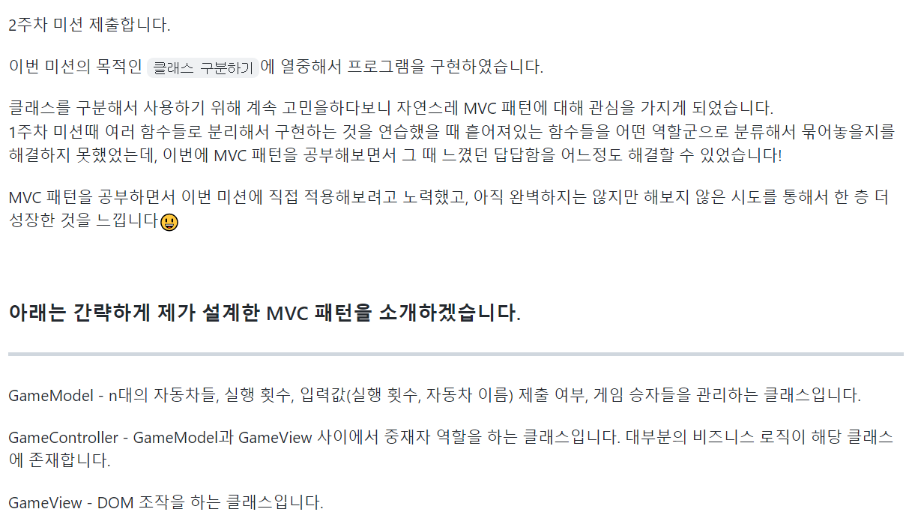
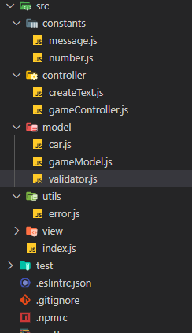

어제부로 프리코스 2주 차가 끝이 났습니다.

이번에도 회고를 남겨보려 합니다😃

본격적인 회고에 앞서, 프리코스에서 제출했었던 1000자 회고 글과 과제 제출 Pull Request(PR) 본문에 적었던 내용을 먼저 첨부합니다.

오늘 받은 2주 차 공통 피드백에서 1000자 회고 글을 다른 교육생 분들이 볼 수 있도록 공유해주면 좋을 것 같다는 말이 있었어서 이번 회고 글부터는 제출했던 1000자 회고 글과 PR을 먼저 첨부해서 보여주려고 합니다. 아마 본문이랑 해당 글들이랑 겹치는 부분이 있을 것이긴 한데 미리보기라고 생각해주시면 감사하겠습니다!

저번 회고를 작성할 때 존댓말이 아닌 반말로 글을 작성하였는데, 이번에도 보다 더 편하게 회고를 하기 위해서 반말로 작성하려고 합니다. 양해부탁드립니다.

<br>

### 프리코스 과제 제출하면서 남겼던 회고 글

---

**<시간을 많이 들였던 부분>**

- 클래스를 분리하여 코드 작성하기
- 적절하고 직관적인 변수명 짓기
- MVC 패턴 적용해서 코드 작성하기

<br>

**<느낀 점>**

1.  class를 분리하여 프로그램을 구현하는 것은 생각보다 쉽지 않았습니다. 이번 미션에서 여러 개의 class를 사용하는 것이 강제되지 않았더라면, 아마 익숙한 함수 방식을 사용해서 프로그램을 구현했을 것입니다. 덕분에, 새로운 경험을 할 수 있었고 이번 기회에 어느 정도 클래스와 친해졌다고 생각합니다.

2.  여러 개의 class를 활용해서 프로그램을 구현해보는 게 처음이어서 그런지 저에게는 쉽지 않은 일이었습니다. 1주 차 때 역할 군에 따라서 여러 개의 함수를 만들어서 프로그램을 구현했던 것처럼 이번에도 역할 군끼리 class를 분리해보려고 했습니다. 결과적으로, 이전보다 더 시간 효율적으로 기능을 추가하거나 변경할 수 있었습니다.

3.  MVC 패턴에 대해서 자연스럽게 관심을 가지게 되었습니다. MVC 패턴 같은 검증된 디자인 패턴을 사용하면 더 체계적으로 역할을 나누면서 가독성 있게 코드를 짤 수 있다는 것을 알 수 있었습니다. 이번 미션에서 직접 MVC 패턴에 따라 class를 나누고 모듈화 하여 프로그램을 구현해보니 이전보다 각 파일의 역할이 눈에 확 들어오게 되었습니다. 그렇다 보니, 새로 기능을 추가하거나 수정할 때 이전보다 더 시간 효율적으로 구현할 수 있었습니다. 이번 기회에 MVC 패턴을 조금 맛볼 수 있었습니다.

4.  처음부터 MVC 패턴을 사용해야지! 해서 사용한 것이 아닙니다. class를 역할 군에 따라 나누는 작업을 어떻게 하면 잘할 수 있을까 고민하다가 자연스레 MVC 패턴을 적용해보고 있는 제 모습을 발견하게 되었습니다.

<br>

### 2주 차 과제 PR에 남긴 글

---



<br>

### 2주 차 미션에서 제일 집중했던 것

---

2주 차 미션에서의 핵심은 `여러 클래스를 나눠서 사용해보는 것`이었다.

이전 미션에서는 친숙한 '함수'를 분리해서 사용하는 것이었기 때문에 미션을 시작하는 데 이번 주와 같은 막막함은 없었다. 하지만, 클래스를 사용하는 것에 대해서는 무지한 상태였기 때문에, 미션을 시작하는 것부터 나에게는 어려운 상황이었다.

그래서 미션에 대한 설계를 하는 과정에서 클래스에 대해서 많이 찾아보고 스스로 어떻게 프로그램을 만들지 많은 고민을 했었다. 하지만, 구글링으로 계속 찾아보기만 해서는 많은 진척이 없었다. 그래서 직접 코드를 작성하면서 배우기로 결정했었다. 미션을 수행하는 것이 아니라, pre-test라는 branch를 따로 만들어서 2주 차 미션을 가지고 클래스로 무작정 구현해보았었다.

설계를 하고 코드를 작성하면서 `이렇게 하는 게 맞나?` `클래스를 이렇게 분리하는 게 맞나?`, `어떤 역할군끼리 나눠야 하지?`, `1주 차 때는 역할군끼리 파일을 만들어서 함수들을 묶어서 관리해주었는데 이거랑 클래스로 하는 거랑 무슨 차이지?`등과 같은 많은 물음들이 내 머릿속에서 돌아다녔다. 이러한 물음들을 하나하나 머릿속에서 꺼내서 해결해보려고 노력했다. 2일 동안 많은 고민을 하고 시행착오를 겪으면서 제대로 된 방향인지는 모르지만 어느 정도 수확을 얻었다.

수많은 고민들 중 제일 시간을 많이 들였던 고민은 바로 `역할군끼리 나눠서 클래스를 생성하는 것을 어떻게 할까?`였다. 어떤 방식으로 해도 머릿속에 역할군들끼리 잘 정비가 되지 않았었다. 그러다가, MVC 패턴을 발견하게 되었다.

MVC패턴은 많은 개발자들이 사용하는 디자인 패턴 중 하나인데, 나는 처음에 MVC 패턴이 왜 이렇게 많이 등장하는지 의문을 가진 상태였다. 하지만, 직접 나의 프로그램에 MVC 패턴을 적용하려고 해 보니 내 머릿속에 있던 대부분의 고민들이 해결이 돼버렸다...(정말 놀라웠다. 이번 미션에서 제일 격정적인 순간이 아닐까 싶다.)

역할군끼리 클래스를 분리해서 사용하는 방법을 명확하게 해결해준 것이었다. Model, Controller, View라는 대분류 안에서 코드들이 유기적으로 서로 소통하면서 프로그램을 동작시키는 것이 내 눈에는 체계가 잘 잡힌 공장 같은 느낌이었다.

<br>

### 직접 MVC 패턴을 적용해서 프로그램을 만들어보았다. 

---

이제, 이번 미션에서 어떤 방식으로 미션에 MVC 패턴을 적용해보았는지 설명해보려고 한다.

<p align="center">
  
</p>

위는 이번 미션(자동차 경주 게임)을 구현한 내 프로그램의 파일 및 폴더 구조이다. 하나하나씩 뜯어보기로 하자😃

코드는 링크를 누르면 가서 볼 수 있다. 설명에 필요한 부분은 직접 인용하였다.

<br>

### 1. Model

model 폴더에는 프로그램에서 쓰이는 데이터를 모아두는 곳이다.

사용자가 입력하는 자동차들(cars), 시행 횟수(racingCount)를 데이터로 보고 진행하였다.

데이터를 다루는 것과 관련된 메서드들은 모두 Model 폴더에 넣어놓았다고 보면 된다.

여기서, 입력값에 대한 유효성 검사(validator.js)를 MVC 중에 누가 담당해야 하나라는 고민을 많이 했었다.

스택오버플로우나 여러 개발 커뮤니티를 돌아다니면서 관련 정보를 살펴보았다. 여러 의견이 있었지만 대부분 Controller vs Model 양상이었다.

Controller라고 말하는 사람들의 의견은 입력값에 대한 유효성 검사는 비즈니스 로직이기 때문에 Controller에서 유효성 검사를 진행하고 통과된 데이터만 Model에 넘겨줘서 Model에서는 저장만 해주면 된다였다.

Model이라고 말하는 사람들의 입장은 Model은 여러 Controller에서 쓰일 수가 있다. 그렇기 때문에 Model에서 데이터에 대한 유효 검사를 해주는 것이 Controller에서 유효성 검사를 해주는 것보다 더 안전하고 효율적이다였다.

아래는 관련 링크들이다. 많은 글들이 있지만 몇 개만 가져왔다.

[관련글1](https://www.google.com/search?q=Controller+validation+site:stackoverflow.com&sa=X&ved=2ahUKEwjQ-M352NP0AhVyKaYKHcF2CfIQrQIoBHoECCsQBQ&biw=1920&bih=937&dpr=1)
[관련글2](https://stackoverflow.com/questions/5305854/best-place-for-validation-in-model-view-controller-model)

2주 차 미션을 수행할 당시 나는 후자의 말에 더 공감이 갔고 Controller에서 Model의 setCars, setRacingCount 메서드를 호출하였을 때 Model 내부에서 입력값들에 대한 유효성 검사를 하는 방식으로 구현하였다.

아직까지 이 부분에 대해서는 고민을 많이 하고 있다. 그래서, 2주 차 미션 PR을 제출 다른 교육생분들의 코드를 살펴보았다. MVC 패턴으로 구현한 거의 모든 교육생분들이 Controller에서 유효성 검사를 진행하는 것을 보니 통상적으로는 Controller에서 해주는 것으로 돼있거나 이번 미션에서는 Controller에서 해주는 게 더 장점이 있었나 보다. (사실, 아직까지도 나는 model이 더 적합하다고 생각하고 있긴하다😀)

코드 스타일에 정답이 있는 것은 아니니 다음 미션 때도 MVC 패턴을 활용해보면서 이 부분에 대해서 고민을 해볼 예정이다.

아래는 Model 폴더 안 세부적인 파일들과 그들에 대해 간단한 설명을 해보려고 한다.

<br>

**car.js**

미션의 요구사항에서 필수로 만들라고 했던 car 클래스이다.

car는 이름을 가질 수 있고, 경주에서 필요한 자기 위치를 프로퍼티로 가지도록 구현하였다.

car는 전진하거나 멈추는 기능을 가지고 있어야 했는데, 전진하는 조건을 스스로 실행할 수 있게 하여 스스로 움직임을 정할 수 있도록 메서드를 구현하였다.

그리고 경주 게임을 한 번 진행하고 나서도 계속 새로운 게임을 진행시키는 게 사용자 입장에서 좋을 것 같아 car 인스턴스 자체에서 자신들의 위치를 초기화하는 기능이 필요했었다. 그래서 초기화하는 메서드도 만들어 주었다.

[car.js 코드](https://github.com/no-used/javascript-racingcar-precourse/blob/1a96f556dbdd65e09cbae239b5f53ac97dbb2efc/src/model/car.js)

<br>

**gameModel.js**

자동차 경주 게임에서는 두 가지의 데이터(자동차 이름들, 시행 횟수)가 입력된다.

그래서 gameModel에서는 경주를 하는 자동차들(this.cars)과 시행 횟수(this.racingCount)를 기본적인 프로퍼티로 가져가는 클래스로 만들어주었다.

이번 미션에서 한 번의 게임 플레이 후 처리에 대해서는 요구사항에 명세되어 있지 않아 나는 한 번 경주 게임을 플레이하고 난 후 이후 처리를 어떻게 해줘야 할지 고민했었다.

1. 다시 게임을 못하게 할지

2. 다시 게임을 하게 할지

내가 사용자라면 이 경주 게임을 친구, 가족, 지인들과 내기를 하기 위해 할 것이라고 생각했다. 그래서 한 번만 플레이 가능하게 하는 것보다는 여러 번 게임을 플레이할 수 있게 하는 게 좋겠다고 생각을 했다. 마음대로 해도 될까 조심스러웠지만 사용자 입장에서 생각해서 완성도 있는 프로그램을 만들어 보고 싶어서 두 번째 방법으로 구현을 해보았다.

두 번째 방법을 구현하기 위해서 게임을 한 번이라도 진행했는지에 대한 프로퍼티를 추가해주었다. 해당 프로퍼티를 Controller에서 활용하여 화면의 렌더링을 다르게 해주어야 하기 때문이다.

마지막으로, gameModel.js에서 게임 승자들(this.winners)에 대한 데이터를 기본적인 프로퍼티로 넣어주었었는데, 생각해보니 게임 승자들은 자동차들(프로퍼티)에 대한 데이터로 만들 수 있는 데이터이기 때문에 따로 프로퍼티로 설정해줄 필요가 없었다.

그렇게 된다면, 승자를 결정하는 함수들은 Controller로 옮겨서 작업하는 게 좋아 보인다.

[gameModel.js 코드](https://github.com/no-used/javascript-racingcar-precourse/blob/1a96f556dbdd65e09cbae239b5f53ac97dbb2efc/src/model/gameModel.js)

<br>

**validator.js**

입력값에 대한 유효성 검사를 하는 코드들을 따로 모듈화 하였다.

Model에서 필요한 유효성 검사는 각각의 자동차 이름, 입력받은 자동차 이름들, 입력받은 시행 횟수였기 때문에 3개의 함수만을 export 해주고 해당 함수들을 구성하는 다른 중첩 함수들은 validator.js 내부에서만 알 수 있도록 코드를 작성하였다.

만약, 따로 모듈화를 해주지 않고 각각의 Model 파일에 작성을 해주었다면, 가독성이 좋지 않은 코드가 되었을 텐데 이렇게 모듈화를 해주고 나니 훨씬 가독성 있는 코드가 될 수 있었던 것 같다.

[validator.js 코드](https://github.com/no-used/javascript-racingcar-precourse/blob/1a96f556dbdd65e09cbae239b5f53ac97dbb2efc/src/model/validator.js)

<br>

### 2. Controller

MVC 패턴을 적용해보면서 가장 어렵게 작성했던 것이 Controller가 아닐까 싶다.

Model과 View의 역할은 머릿속에 잘 들어왔다면 이 둘 사이에서 역할을 하는 Controller는 어떻게 작동되어야 하는지가 좀 이해하기 어려웠기 때문이다.

지금은, Model과 View의 메서드들을 호출해서 프로그램을 작동시키는 역할이라고 이해를 하고 있다. 아마, 100% 정답은 아닐 것이다. 계속 공부해나가야 한다.

Controller에서는 사용자들의 입력값이나 상호작용들을 캐치해내서 View와 Model을 적절하게 이용해주는 방식으로 코드를 작성하였다.

<br>

**gameController.js**

사용자가 경주 게임 웹사이트에 접속하게 되면 바로 생성되는 클래스이다.

즉, gameController 인스턴스가 사용자가 경주 게임을 할 수 있도록 해주는 것과 마찬가지라고 이해하면 될 것 같다.

사용자가 입력값들(자동차 이름들, 경주 시행 횟수)을 제출하는 이벤트가 발생할 때마다 적절한 Model과 View를 호출해주고 play라는 메서드를 활용해 게임을 진행하는 클래스이다.

처음에는 어떤 것들이 gameController 클래스에 포함되어야 하는지 생각해내는 게 어려웠는데 작성하다 보니까 Controller의 역할에 대해서 조금은 알게 된 것 같다. 이번 주에 1주 차 미션을 MVC 패턴으로 구현을 해보면서 조금 더 감을 익혀 볼 예정이다.

[gameController.js 코드](https://github.com/no-used/javascript-racingcar-precourse/blob/1a96f556dbdd65e09cbae239b5f53ac97dbb2efc/src/controller/gameController.js)

<br>

**createText.js**

이 파일은 gameController 클래스에서 View에 보내줄 HTML text를 추출해내는 함수들을 따로 분리해 모듈화 한 파일이다.

MVC 패턴으로 구현하면서, 이런 고민을 했었다.

1. Controller에서 View로 HTML Text를 보내주는 게 맞는 건지?

2. Controller에서 게임 결과에 대한 String만 보내주면 View에서 HTML Text로 가공하는 게 맞는 건지?

이 고민에 대한 해답은 이번 미션에 내리지 못했다. 그래서 두 방법을 모두 써봤던 것 같다.

HTML Text로 보내준 것도 있고 String만 보내서 View에서 가공하도록 한 것도 있다.

사실, 한 가지 방법으로 통일하지 않고 프로그램을 만드는 것은 좋은 방법은 아닌 것은 안다. 하지만, 프리코스는 스스로 공부를 하고 성장하는 과정이라고 생각한다. 그래서, 두 가지 방법을 다 사용해보고 느낀 점을 통해서 다음 미션 때 둘 중에 하나의 방법을 선택해서 사용해보려고 한다.

아직은 잘 모르겠다...🤔

[createText.js 코드](https://github.com/no-used/javascript-racingcar-precourse/blob/1a96f556dbdd65e09cbae239b5f53ac97dbb2efc/src/controller/createText.js)

<br>

### 3. View

마지막으로 View이다.

View는 나름대로 명확했다. DOM 조작은 다 View로 몰아주었다.

그래서 View 클래스로 인하여 인스턴스가 생성될 때 프로그램에서 사용될 Element를 document.querySelector로 지정해서 프로퍼티로 다 넣어주었다. 이렇게 해주면, Controller에서 따로 DOM을 선택할 필요가 없기 때문이라고 생각했다.

input창 리셋 메서드, 처음 시작할 때 DOM을 숨겨주는 메서드, DOM을 보여주는 메서드 등 DOM 조작과 관련한 모든 메서드들을 넣어주었다.

근데, 아래 코드처럼 이렇게 하는 게 효율적인 방법인지는 확신이 들지 않아서 더 공부해볼 예정이다.

```
export default class GameView {
  constructor() {
    this.$app = $('#app');
    this.$racingCountTitle = $('#racing-count-title');
    this.$racingCountForm = $('#racing-count-form');
    this.$racingResultTitle = $('#racing-result-title');
    this.$racingCountInput = $('#racing-count-input');
    this.$carNamesInput = $('#car-names-input');
    this.$carNamesForm = $('#car-names-form');

    this.init();
  }

  init() {
    this.hide(this.$racingCountTitle);
    this.hide(this.$racingCountForm);
    this.hide(this.$racingResultTitle);
    this.$racingResultTitle.insertAdjacentHTML('afterend', '<div id="racing-result"></div>');
    this.$racingResult = $('#racing-result');
  }
```

[gameView.js 코드](https://github.com/no-used/javascript-racingcar-precourse/blob/1a96f556dbdd65e09cbae239b5f53ac97dbb2efc/src/view/gameView.js)

<br>

#### 4. Error

추가적으로, 이번에 try... catch... 구문을 활용해서 error 처리를 해주었다.

아래처럼, 입력값으로 받은 자동차 이름들을 가지고 Model에 데이터를 저장해주는 메서드를 try... catch문으로 감싸주었다.

```javascript
try {
  this.gameModel.setCars(this.gameView.$carNamesInput.value)
} catch (err) {
  this.gameView.resetCarNamesInput()

  return showError(err)
}
```

이렇게 해보니, setCars 메서드에서 진행하는 모든 로직들에서 throw new Error를 해주게 되면 해당 error를 출력해줄 수 있었다. (아래는 setCars 메서드에서 사용하는 함수중 하나)

```javascript
const isValidatedLength = (userInputArray, givenLength) => {
  if (userInputArray.length >= givenLength) return true

  throwError(MESSAGE.ERROR.NOT_MEET_CARS_NUM_CONDITION)
}
```

이전에 if문을 통해서 에러를 분기 처리해주었을 때보다 더 쉽게 에러를 분기 처리해줄 수 있었다.

근데, try... catch문을 사용해본 적이 많지 않아 이렇게 해주는 게 맞나 싶긴 하다. 3주 차 미션 때 신경 써서 적용해볼 것 중 하나다🤔

<br>

### 회고를 마무리하며

---

이번 미션도 저번 미션처럼 배울 게 많은 미션이었다. 미션을 시작하기 전에는 내가 MVC 패턴을 직접 적용해볼 것이라고는 상상도 못 했었는데 어찌 보니 하고 있는 나를 발견하니 신기했다. 객관적으로는 모르겠지만, 주관적으로는 미션을 통해서 점점 성장하고 있는 것 같다.

직접 MVC 패턴을 적용해보니 디자인 패턴을 왜 공부하는지, 왜 개발에 내로라하는 사람들이 만들어 놓은 것들을 사람들이 배우려고 하는 지를 알게 되는 순간이 아니었나 싶다. 하지만, 항상 의문을 가지고 정보들을 받아들이려고 하는 습관을 잊지 말아야겠다고도 느꼈다. 왜냐하면 개발에는 정답이 없고 각자 환경과 상황이 다르니까..

클래스를 어떻게 분리할 지에 대해서 MVC 패턴이 100% 해답은 아닐 수 있다. 애초에 내가 잘못하고 있는 걸지도 모른다. 하지만 이번 기회에 하나의 디자인 패턴을 공부해서 적용하여 프로그램을 만들어 본 경험은 내가 추후에 다른 디자인 패턴을 공부해서 적용해보는 데에 대한 두려움을 허물어주었다고 생각한다. 이번 프리코스에서 경험한 좋았던 순간들 중 하나가 아닐까 싶다.

앞으로 10일 정도가 남았다.

이번 프리코스에서 배운 것들이 정말 많다. 모든 것을 체화시킬 수는 없겠지만 그럴 수 있도록 꾸준히 학습하려고 한다.

글 읽어 주셔서 감사합니다.

_**아래는 이번 미션 Repository입니다. 보시고 피드백 주시면 언제나 환영입니다.**_

[javascript-racingcar-precourse Repository](https://github.com/no-used/javascript-racingcar-precourse)
