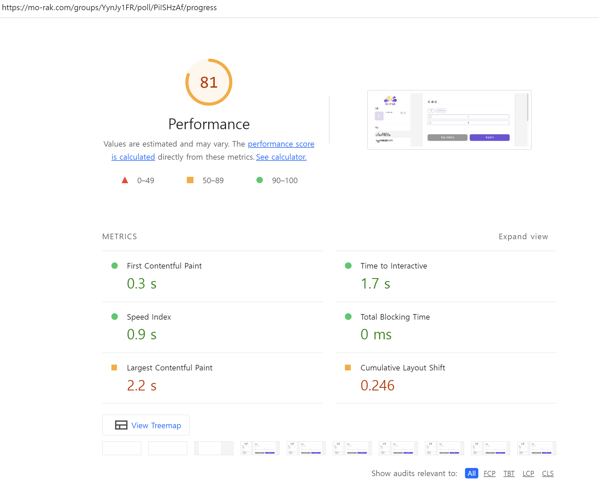

우아한 테크 코스라는 교육에 참여하여 백엔드와 프론트엔드 과정 교육생들끼리 프로젝트를 진행했었다.모임을 편하게 진행할 수 있도록 도와주는 서비스인 <a href="https://mo-rak.com/" target="_blank">모락</a>을 개발하면서 성능 최적화를 진행했던 경험을 공유하려고 한다. 이번 포스팅은 특별히 시리즈로 구성해보았다.

## 여행기라는 제목을 지은 이유

하나의 포스팅에 모든 내용을 담기에는 가독성이 떨어질 것 같아 여러 개의 포스팅으로 내용을 나눌 예정이라 `여행기`라고 지어보았다. 그리고 또 생각해보면, `여행`이라는 것은 출발지와 목적지가 뚜렷하게 존재하는 경우가 대부분이다. 성능 최적화를 하려고 하는 이유라는 출발지에서 성능 측정하기, 성능 개선하기라는 경로를 거쳐서 추후 계획이라는 목적지로 이루어지는 것이 하나의 여행처럼 느껴져서 `여행기`라는 제목을 붙여보았다🚗

이번 포스팅에서 다룰 내용은 `성능 최적화를 하려고 하는 이유`와 `성능 측정하기`이다.

## why 성능 최적화?

사용자 경험을 개선하여 서비스의 목적을 이루기 위해서라고 말할 수 있다.

`모락`이라는 서비스는 사람들이 모임을 진행할 때 불편한 것들을 사이트에 접속해서 빠르게 해결하고 다시 모임에 집중할 수 있도록 도와주는 게 우리의 메인 목표이다. `빠르게`라는 게 서비스의 주요 포인트인데, 만약, 성능이 좋지 않아 사용자들이 많은 시간을 기다려야 한다면?? 그렇게 되면, 우리 서비스의 목표를 이룰 수 없게 되면서, 서비스 자체의 근간이 흔들릴 수 있을 것이다. 이렇게, `모락`은 성능이 미치는 영향이 큰 서비스이고 성능이 사용자 경험에 큰 영향을 줄 수 있다고 판단하여 성능 최적화를 해주기로 했다.

## 그렇다고, 무작정 성능 최적화를 하면 안된다.

성능 최적화를 하기 위해서는, 여러 개념을 공부해야 하고, 이를 적용하기 위해 수많은 시행착오를 겪기 때문에 하나의 비용이라고 생각해야 한다. 그래서, 어디서 성능 최적화가 좋다는 이야기를 듣고 무작정 성능 최적화~ 이러면서 도입을 하는 것은 개발자로서 피해야 할 상황이다.

**그럼, 언제 해야 하는데?**

모락 서비스의 성능을 최적화하려고 하는 이유는 다음과 같았다.

`우리의 서비스는 속도가 생명이기 때문에!!!`

사용자들이 서비스를 사용해서 모임에서 불편했던 부분들을 `빠르게` 해결하고 나가는 것이 중요하기 때문에 최대한 성능을 개선해주는 게 중요하다고 생각했다.

### 성능 측정을 먼저 해보자

하지만, 앞에서 말했다시피 성능 최적화도 하나의 비용이기 때문에 무작정 성능 개선을 해줄 수는 없었다. 서비스에서 `속도`가 중요하다고 무작정 개선했는데, 이미 우리가 개발한 서비스의 성능이 개선할 필요 없이 빠른 상황이었다면? 생각만 해도 끔찍한 상황이다.

그렇다면, 어떻게 해야 할까? 성능을 측정해보면 된다. 측정해보고 개선이 필요한 상황임을 확인한 후에 개선을 진행하면 앞의 상황은 방지해줄 수 있다. 그래서, 프론트엔드 팀원과 회의를 거친 후에 `현재 우리 서비스의 성능 리포트`를 만들기로 했다.

#### 1. 성능 관리 대상 설정하기

먼저, 성능 관리 대상을 설정해주기로 했다. 모든 기능들의 성능을 개선하면 좋겠지만, 시간은 제한적이기 때문에 주요 서비스에서만큼이라도 최소한의 성능을 보장해주자고 결정했다. 사용자는 서비스에 접속해 로그인하고, 그룹을 만들고 투표나 약속 잡기를 만들고, 투표나 약속 잡기를 진행할 것이다. 이 부분들을 성능 관리 대상으로 정하기로 했다.

최종적으로 결정한 성능 관리 대상은 아래와 같다.

- 로그인
- 그룹 생성 및 참가
- 투표하기 생성 및 진행
- 약속 잡기 생성 및 진행

 

#### 2. 성능 관리 환경 설정하기

성능 관리 대상만큼 중요한 것이 성능 관련 환경에 대한 설정이다. 맥북 사용자, 윈도우 사용자, 데스크탑 뷰, 모바일 뷰등 서비스를 사용하는 사용자들의 환경은 각각 다를 것이다. 모든 환경의 사용자들에 대해서 최고의 성능을 제공하면 좋겠지만, 시간이 제한적이기 때문에 관리를 집중적으로 진행할 환경을 설정해주기로 했다. 우리 서비스는 우아한테크코스 교육처럼 온라인으로 교육을 듣고 모임을 진행하는 사람들이 대상이다. 그러므로, 처음부터 모바일보다는 데스크탑 뷰를 타겟으로 했었고, 온라인 교육은 IT 교육인 경우가 많으므로 윈도우보다는 맥북 사용자를 타겟으로 했었다.

최종적으로 결정한 성능 관리 환경은 아래와 같다.

- 데스크탑 뷰
- 맥북

 

#### 3. 성능 예산 정하기

성능 관리 대상과 환경을 설정했다면, 성능 개선을 어느 정도까지 할지에 대한 기준을 세울 차례다. 기준이 존재하지 않는다면, 성능을 개선했더라도 얼마나 개선이 되었고, 또 얼마나 더 개선해야 하는 지가 애매해질 것이다. 이를, 판단할 수 있는 성능 예산이 필요하다. 고민 끝에, 구글에서 제공하는 `Lighthouse`의 점수를 기반으로 진행하기로 했다.

> Google Lighthouse는 웹페이지 품질을 측정하기 위한 자동화된 오픈 소스 도구이다. [https://en.wikipedia.org/wiki/Google_Lighthouse](https://en.wikipedia.org/wiki/Google_Lighthouse)

 

**왜 Lighthouse를 선택했을까?**

1. Lighthouse의 점수 기반이 되는 FCP, LCP, TTI, TBT, CLS와 같은 지표들이 우리 서비스 사용자의 경험을 개선할 수 있는 중요 지표라고 생각했기 때문이다.

   - FCP(First Contentful Paint) - 우리 서비스는 속도가 중요하기 때문에, 첫 컨텐츠의 렌더링이 늦어버리면 사용자가 이탈할 확률이 커진다. 따라서, 첫 콘텐츠가 보여지는 시간을 측정하는 FCP를 측정할 필요가 있다.
   - LCP(Largest Contentful Paint) - 주요 컨텐츠가 빠르게 보이면, 그만큼 사용자가 빠르게 서비스를 사용할 수 있다. 따라서, 주요 콘텐츠가 페이지에서 얼마나 빠르게 로딩이 되는지 측정하는 LCP를 측정할 필요가 있다.
   - TTI(Time To Interactive) - 우리 서비스는 사용자들과의 상호작용이 많으므로, 페이지가 사용자와 완전히 상호 작용이 가능하게 되는데 걸리는 시간인 TTI를 측정할 필요가 있다.
   - TBT(Total Blocking Time) - 사용자와의 상호작용이 많은 만큼, 인터랙션을 했을 때 얼마나 빠르게 응답이 오는지도 매우 중요하다. 따라서, 인터랙션을 했을 때 얼마나 빠르게 응답이 오는지 측정하는 FID를 선택했으나, FID는 실제 사용자가 필요한 측정이기 때문에 FID의 성능과 상관관계가 있는 TBT를 측정할 필요가 있다.
   - CLS(Cumulativ Layout Shift) - 사용자가 상호작용을 하려고 할 때, 화면의 요소가 원래 있던 곳에서 다른 곳으로 이동을 하게 되면 사용자는 원하는 상호작용을 빠르게 할 수 없어진다. 이처럼 layout shift가 얼마나 일어나는지를 측정하는 CLS를 측정할 필요가 있다.

2. 성능 측정이 편하기 때문이다. 성능 측정이 편해야 자주 측정을 할 수 있고, 자주 측정하면서 계속해서 성능을 개선할 수 있기 때문이다.

위와 같은 이유로 Lighthouse의 점수를 성능 예산으로 설정하였고, 최소 95점 이상을 목표로 설정하였다.

 

#### 4. 성능 측정하기

이제, 모든 준비는 끝났다. 성능을 측정해보자

여기서, 중요하게 짚고 넘어가야 할 부분이 있다. 성능 측정하는 환경을 최대한 동일하게 가져가야 한다는 것이다. 환경이 다르면 똑같은 웹 사이트라도 다르게 성능이 나올 가능성이 있기 때문이다. 우리는, 다음과 같은 환경에서 성능을 측정해주기로 했다.

- 크롬 시크릿 모드
- 데스크탑 기준
- 맥북 프로 14인치

아래는, 성능 관리 대상들을 Lighthouse로 측정한 결과들이다.

 

**랜딩 페이지**

**로그인 페이지**

**그룹 생성 및 참가 페이지**

**투표 생성 페이지**

**투표 진행 페이지**

**약속잡기 생성 페이지**

**약속잡기 진행 페이지**

 

측정해보니, 투표와 약속 잡기 생성과 진행 페이지의 성능 점수가 기준으로 잡았던 95점에 못 미치는 것을 확인하였고 성능 최적화를 진행해주면 된다. 다음 포스팅에서 성능 최적화 여행을 더 이어서 해보려한다😀
