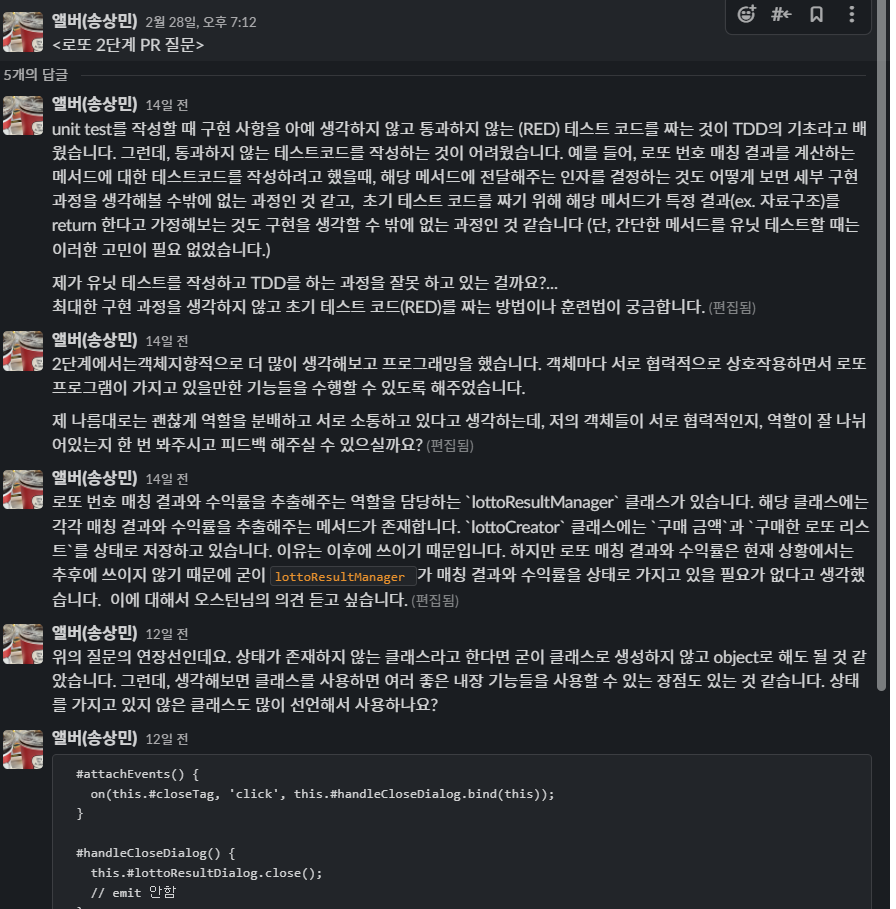
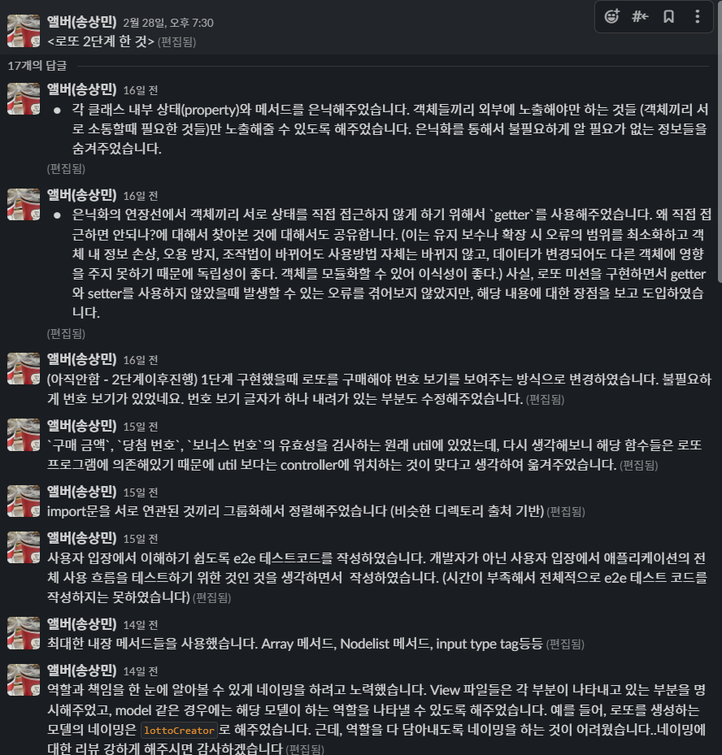

로또 미션에 대한 회고를 작성하려고 한다. 이번 미션은 로또를 구매하고 구매한 로또에 대한 당첨 결과를 보여줄 수 있는 웹 사이트를 만드는 것이다.

## 페어 프로그래밍

이번에도 역시 페어로 미션을 시작했다. 저번에 페어를 하면서 느낀 점들이 많아서 이번에는 이를 개선해보고자 했다. 여러 포인트들 중에서 이번 페어에서는 꼭 해보고 싶었던 것이 나의 생각을 근거 있게 주장하기였다. 그래서 이번 페어를 하면서 이해가 되지 않는 부분에 대해서는 페어에게 정중히 물어보고 거기서 내가 생각하는 것을 이유를 가지고 주장해보려고 많이 시도했다. 이전보다는 많이 할 수 있었지만, 직접 이렇게 해보니 내가 주장하려고 하는 부분에 대한 확신이 많이 없구나라고 느껴졌다. 아마, 근거는 어느 정도 가지고 있지만 깊게 공부해서 머릿속에 제대로 담고 있지 않는 느낌이었다. 스스로 개념에 대해서 가르치는 방식으로 지식을 머리에 잘 담아놔야겠다....

이외에는 무난하게 페어로 개발을 한 것 같다. 엄청 잘했다거나 못했다거나가 아닌 정말 평균의 개발이었다고 생각한다.

## MVC 패턴을 사용한 것에 대해 반성하다

1단계 제출이 끝난 후, 우테코 코치님들에게 전체적으로 혼(?)이 난 경우가 있다. 실제로 심한 말을 들으면서 혼난 것이 아니라 대부분의 크루들이 뜨끔할만한 포인트를 말씀해주셨던 것이다. 이번에, 우리 페어를 포함한 대부분의 페어들이 MVC 패턴을 사용했다고 한다. 왜 이 패턴을 다 썼는지 모르겠다. 솔직히 레벨1때는 패턴이 필요 없다. 기본에 더 충실하는 게 좋다.라는 여러 말을 해주셨다. 나도 MVC 패턴을 왜 썼나 되돌아봤을 때 그냥 편했기 때문에 익숙했기 때문에 사용을 했었다. 예전에 프리코스 때부터 UI와 도메인을 분리하기 위해 고민을 하다가 MVC 패턴을 찾게 되었고 이를 활용해보니 UI와 도메인의 역할 분리가 편했었다. 그래서 지금까지 MVC 패턴을 사용했었는데 지금 와서 보니 정말 필요했나?라는 생각이 들었다. 남들이 만든 패턴을 가져다 쓰는 것이 아니라 스스로 학습을 하면서 본인만의 패턴을 만드는 게 우테코의 목적과 더 잘 맞는다고 생각한다. 이번 수업을 통해서 한 번 더 내가 작성한 코드에 이유를 담고 내 생각을 담는 게 중요하다, 문제를 맞닥뜨리고 문제를 해결하기 위해 노력해야지, 문제를 해결하는 방법을 먼저 사용하는 것은 순서가 잘못됐다라는 것을 깨닫게 되는 계기였다.

## 개발을 하면서 생각했던 점들을 정리하다.

이번에 2단계를 진행하면서, 고민했던 부분들, 구현했던 부분들, 질문할 부분들을 실시간으로 정리하면서 개발을 진행했다. 실시간으로 고민했던 부분들을 slack에 적어놓고, 질문할 것들도 따로 분리해 놓으면서 내가 개발을 하고, 코드를 작성하면서 작성한 코드에 내 생각을 담을 수 있었다. 예전에는, 생각을 정리하지 않았기 때문에 단순히 문제를 만나면 해결하는 데에 급급했던 것 같다. 근데 생각을 정리하려고 의도적으로 생각하니까, 생각을 정리하기 위해 코드를 작성하면서 생각을 더 하게 되는 것 같다.

아래를 보면 코드를 작성하면서 생각했던 것들을 작성해놓았다. 지금 다시 보니 이때 내가 무슨 생각을 해면서 해당 코드들을 작성했는지 확인할 수 있으니 좋은 것 같다. 이번에 유튜브 미션 2단계를 할 때도 이렇게 내가 작성한 코드, 고민했던 부분들을 적어보려고 한다. 그냥 적으면 된다.

## 앞으로의 계획

벌써 2개의 미션을 우테코 본 코스에서 진행하였다. 솔직히 실력이 느는지 잘 모르겠다... 하지만 최근 코치님과의 면담을 통해 몇 가지 솔루션을 얻게 되었다. 앞으로, 해당 솔루션을 활용해서 현재의 고민을 해결해보고자 한다.

이번 미션의 가장 큰 수확은 내가 작성한 코드에 내 생각 담기이다. 앞으로, 코드를 작성할때 했던 나의 고민들과 어떠한 생각으로 해당 코드들을 작성했는지를 꾸준히 정리하면서 개발할 예정이다.

## 미션 링크

[로또 미션 1단계 PR](https://github.com/woowacourse/javascript-lotto/pull/90)

[로또 미션 2단계 PR](https://github.com/woowacourse/javascript-lotto/pull/136)

[로또 미션 1단계 저장소](https://github.com/al-bur/javascript-lotto/tree/step1)

[로또 미션 2단계 저장소](https://github.com/al-bur/javascript-lotto/tree/step2)
