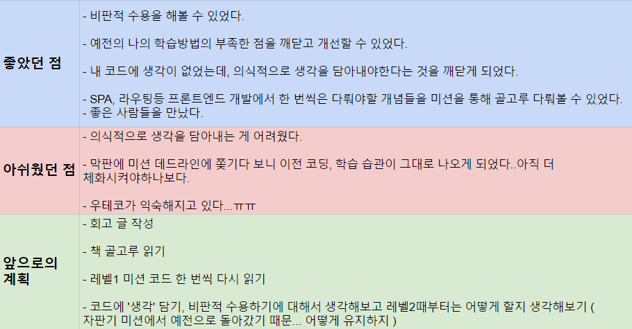

## 레벨 1 회고

레벨 1을 마무리하는 방학식이 진행되었고, 오전에는 레벨 1을 회고하는 시간을 보이는 라디오 조원분들이랑 가졌었다.이전에도 중간중간에 회고하는 시간이 있었지만, 오늘이 제일 유익했던 시간이었다.

앞에서 말했지만, 이번 자판기 미션은 여러 미션중에서 가장 다급하게 끝냈던 미션이었다. 그래서 그런지, 머릿속의 생각이 정리가 되지 않았고 지친 상태여서 스스로 회고를 하려고도 하지 않았었다. 이때, 회고를 강제로 하게 해줘서 정말 고마웠다.



좋았던 점도 많았고 아쉬운 점도 많았다. 특히, 우테코의 미션의 과정들이 익숙해지고 있다는 게 가장 아쉬운 것 같다...익숙해지면서 이전과 비교했을 때 적은 열정으로 미션을 행하는 내 모습을 발견하게 되었다..이것은 내가 조금 지쳐서 그런게 아닐까 생각이 된다..에너지 충전 아자아자

## 아무튼 결론은 '메인에 집중하자'

지금 글을 작성하면서 든 생각은 역시 메인에 집중하자이다. 머릿속이 복잡하면 그냥 메인에 집중하면 된다.

```javascript
class 메인 {
 constructor {
  this.집중할것들 = [자바스크립트 공부하기, 내 생각을 담아서 코딩하기]
 }

 집중하기() {
  실행하다(this.집중할것들)
 }

 자바스크립트 공부하기() {}

 내 생각을 담아서 코딩하기() {}
}
```
