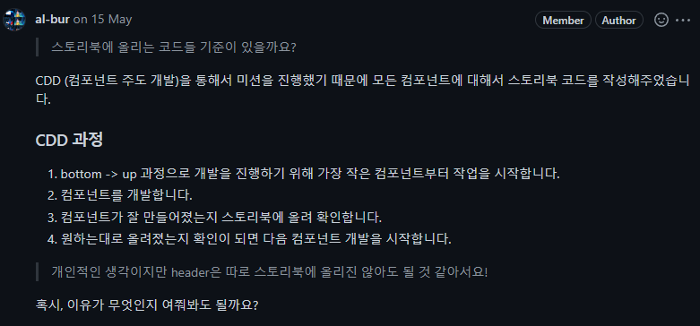
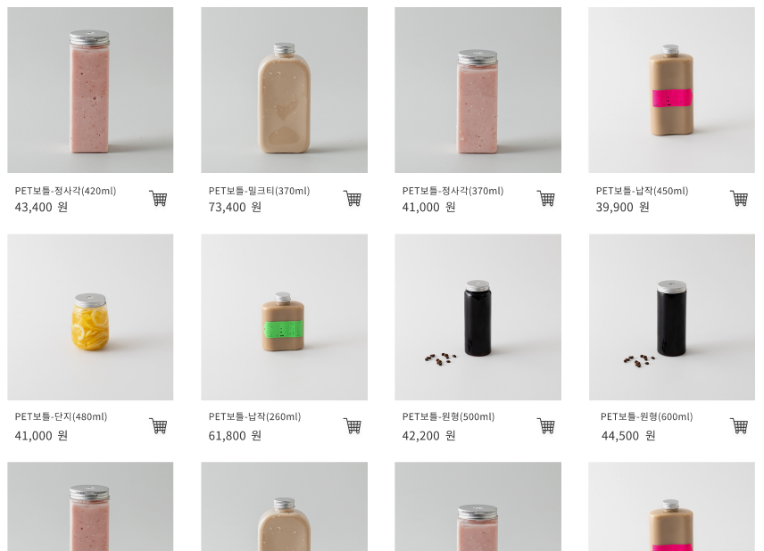
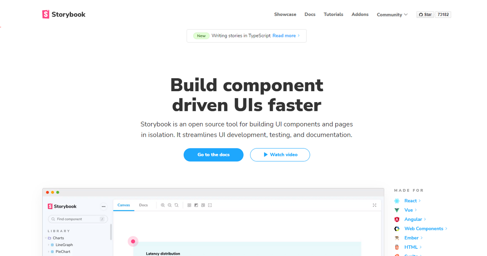
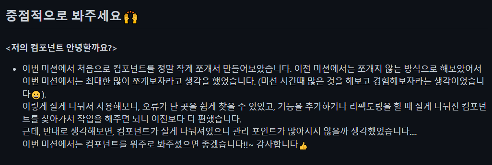
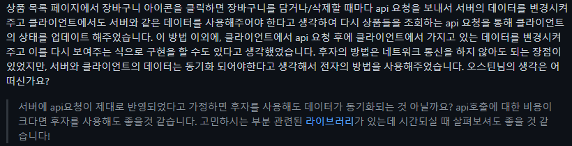

리액트 페이먼츠 미션 이후에 장바구니를 구현하는 미션을 진행하였다.

## 컴포넌트를 잘게 나눠보다 

이번 미션에서는 storybook을 적극적으로 활용해보았다. (무려, 100%에 버금가는 storybook coverage를 자랑했었다.)

최대한 페어와 bottom-up으로 개발을 진행해보자!라고 해서 시작된 것이었다. bottom-up으로 해보게 된 이유는 여러 가지 이유가 있었는데, 일단 첫 번째는 top-down이랑 비교를 해보기 위해서였다. 이전에는 top-down으로 개발을 해보았었는데, bottom-up이라는 방식으로 개발을 해보고 이 둘을 비교해보고 싶었다. 두 번째 이유는 오직 컴포넌트에만 집중해보고 싶었기 때문이다. bottom-up 방식으로 개발을 하면서 이와 동시에 CDD (component driven development)를 진행해보았다(사실, 내가 정말로 정석적인 CDD를 진행한 지는 잘 모르겠다. 일단, 가장 조그마한 컴포넌트부터 만드는 방식을 활용했다고 생각하면 될 것 같다). 하나의 페이지를 만들 때, 화면을 부분으로 나누고 또 그 부분에서 작은 컴포넌트로 분리될만한 것들을 나눠서 그것부터 개발을 했었다.



예를 들어, 아래와 같은 페이지를 만든다는 상황이라고 가정한다면, 맨 바깥의 레이아웃부터 개발하는 것이 아니라 저기 조그마한 PET보틀-정사각(370ml) 같은 상품에 대한 정보들이 들어있는 컴포넌트(제품 설명 또는 카트 아이콘)부터 설계하고 개발을 해나가는 것이다.



## Stoyrybook의 도움을 받다

더불어, Storybook이 없었다면 bottom-up으로 개발을 하는데 많은 불편함이 있었을 것이다. 컴포넌트의 주요 목적은 화면에 UI를 보여주는 것이다. 그러니, 컴포넌트를 개발을 할 때는 화면에 제대로 렌더링 되는 지를 지속적으로 확인해줘야 한다. 평소 같았으면, test용 페이지를 만들어서, 거기에 현재 만들고 있는 컴포넌트를 import 해서 렌더링 해보고 잘 개발되고 있구나라고 생각했을 것이다. 하지만, 계속 만들고 있는 컴포넌트를 import 하고, 끝나면 다시 지우고, 나중에 다시 확인해보고 싶으면 다시 import 하고 이러한 방식이 사실상 많이 귀찮은 작업이다. 이럴 때는 Storybook을 사용해주면 된다.



Storybook 메인페이지 자체에서도 Build Component driven UIs faster이라고 대문짝 하게 나와있다.

아래는 이번 프로젝트에서, Button 컴포넌트를 만들고 이를 storybook에서 UI 테스트하기 위해 작성한 코드이다. 이렇게 코드를 작성하고, storybook 파일을 build 하고 local에 서버를 띄워서 확인할 수 있다. 생각보다 많이 간편했다. 아마, 활용할 수 있는 기능이 많을 것 같지만 현재는 단순히 UI 확인용으로 사용해도 충분했다.

```javascript
import Button from 'components/@shared/Button/Button'

export default {
  title: 'Button',
  component: Button,
}

const Template = (args) => <Button {...args}></Button>

export const ShoppingCartButton = Template.bind({})
ShoppingCartButton.args = {
  children: '장바구니',
}
```

[배포된 storybook은 여기서 확인해볼 수 있다.](https://627cc2af40cd06004a33c028-ljyfbzwkae.chromatic.com/?path=/story/button--shopping-cart-button)

## 잘게 나눠진 컴포넌트들

이렇게 storybook과 함께 bottom-up으로 개발하다보니 너무 많은 컴포넌트가 만들어진 느낌이었다. 최대한 재사용 컴포넌트들도 많이 만들어서 활용해주려고 했지만, 아래에 있는 컴포넌트들이 최선의 결과였다.

```
 ┃ ┣ 📂component
 ┃ ┃ ┣ 📂@shared
 ┃ ┃ ┃ ┣ 📂Button
 ┃ ┃ ┃ ┃ ┣ 📜Button.jsx
 ┃ ┃ ┃ ┃ ┗ 📜Button.stories.jsx
 ┃ ┃ ┃ ┣ 📂CheckBox
 ┃ ┃ ┃ ┃ ┣ 📜CheckBox.jsx
 ┃ ┃ ┃ ┃ ┗ 📜CheckBox.stories.jsx
 ┃ ┃ ┃ ┣ 📂ErrorBoundary
 ┃ ┃ ┃ ┃ ┗ 📜ErrorBoundary.jsx
 ┃ ┃ ┃ ┣ 📂Header
 ┃ ┃ ┃ ┃ ┣ 📜Header.jsx
 ┃ ┃ ┃ ┃ ┗ 📜Header.stories.jsx
 ┃ ┃ ┃ ┣ 📂NavigateButton
 ┃ ┃ ┃ ┃ ┣ 📜NavigateButton.jsx
 ┃ ┃ ┃ ┃ ┗ 📜NavigateButton.stories.jsx
 ┃ ┃ ┃ ┣ 📂PageTitle
 ┃ ┃ ┃ ┃ ┣ 📜PageTitle.jsx
 ┃ ┃ ┃ ┃ ┗ 📜PageTitle.stories.jsx
 ┃ ┃ ┃ ┣ 📂Pagination
 ┃ ┃ ┃ ┃ ┣ 📜Pagination.jsx
 ┃ ┃ ┃ ┃ ┗ 📜Pagination.stories.jsx
 ┃ ┃ ┃ ┣ 📂PaginationButton
 ┃ ┃ ┃ ┃ ┣ 📜PaginationButton.jsx
 ┃ ┃ ┃ ┃ ┗ 📜PaginationButton.stories.jsx
 ┃ ┃ ┃ ┣ 📂ProductName
 ┃ ┃ ┃ ┃ ┣ 📜ProductName.jsx
 ┃ ┃ ┃ ┃ ┗ 📜ProductName.stories.jsx
 ┃ ┃ ┃ ┣ 📂ProductPrice
 ┃ ┃ ┃ ┃ ┣ 📜ProductPrice.jsx
 ┃ ┃ ┃ ┃ ┗ 📜ProductPrice.stories.jsx
 ┃ ┃ ┃ ┣ 📂ProductThumbnail
 ┃ ┃ ┃ ┃ ┣ 📜ProductThumbnail.jsx
 ┃ ┃ ┃ ┃ ┗ 📜ProductThumbnail.stories.jsx
 ┃ ┃ ┃ ┣ 📂Spinner
 ┃ ┃ ┃ ┃ ┣ 📜Spinner.jsx
 ┃ ┃ ┃ ┃ ┗ 📜Spinner.stories.jsx
 ┃ ┃ ┃ ┗ 📂WithSpinner
 ┃ ┃ ┃ ┃ ┗ 📜WithSpinner.jsx
 ┃ ┃ ┣ 📂AllSelectButton
 ┃ ┃ ┃ ┣ 📜AllSelectButton.jsx
 ┃ ┃ ┃ ┗ 📜AllSelectButton.stories.jsx
 ┃ ┃ ┣ 📂CartLeftSection
 ┃ ┃ ┃ ┣ 📜CartLeftSection.jsx
 ┃ ┃ ┃ ┗ 📜CartLeftSection.stories.jsx
 ┃ ┃ ┣ 📂ExpectedPaymentBottomContainer
 ┃ ┃ ┃ ┣ 📜ExpectedPaymentBottomContainer.jsx
 ┃ ┃ ┃ ┗ 📜ExpectedPaymentBottomContainer.stories.jsx
 ┃ ┃ ┣ 📂ExpectedPaymentBox
 ┃ ┃ ┃ ┣ 📜ExpectedPaymentBox.jsx
 ┃ ┃ ┃ ┗ 📜ExpectedPaymentBox.stories.jsx
 ┃ ┃ ┣ 📂ExpectedPaymentContainer
 ┃ ┃ ┃ ┣ 📜ExpectedPaymentContainer.jsx
 ┃ ┃ ┃ ┗ 📜ExpectedPaymentContainer.stories.jsx
 ┃ ┃ ┣ 📂ExpectedPaymentTopContainer
 ┃ ┃ ┃ ┣ 📜ExpectedPaymentTopContainer.jsx
 ┃ ┃ ┃ ┗ 📜ExpectedPaymentTopContainer.stories.jsx
 ┃ ┃ ┣ 📂ItemCounter
 ┃ ┃ ┃ ┣ 📜ItemCounter.jsx
 ┃ ┃ ┃ ┗ 📜ItemCounter.stories.jsx
 ┃ ┃ ┣ 📂OrderButton
 ┃ ┃ ┃ ┣ 📜OrderButton.jsx
 ┃ ┃ ┃ ┗ 📜OrderButton.stories.jsx
 ┃ ┃ ┣ 📂ProductCard
 ┃ ┃ ┃ ┣ 📜ProductCard.jsx
 ┃ ┃ ┃ ┗ 📜ProductCard.stories.jsx
 ┃ ┃ ┣ 📂ProductCardInfo
 ┃ ┃ ┃ ┣ 📜ProductCardInfo.jsx
 ┃ ┃ ┃ ┗ 📜ProductCardInfo.stories.jsx
 ┃ ┃ ┣ 📂ProductDeleteButton
 ┃ ┃ ┃ ┣ 📜ProductDeleteButton.jsx
 ┃ ┃ ┃ ┗ 📜ProductDeleteButton.stories.jsx
 ┃ ┃ ┣ 📂ShoppingCartButton
 ┃ ┃ ┃ ┗ 📜ShoppingCartButton.jsx
 ┃ ┃ ┣ 📂ShoppingCartItem
 ┃ ┃ ┃ ┣ 📜ShoppingCartItem.jsx
 ┃ ┃ ┃ ┗ 📜ShoppingCartItem.stories.jsx
 ┃ ┃ ┗ 📂ShoppingCartItemsContainer
 ┃ ┃ ┃ ┣ 📜ShoppingCartItemsContainer.jsx
 ┃ ┃ ┃ ┗ 📜ShoppingCartItemsContainer.stories.jsx
```

컴포넌트를 잘게 나눠보니 느낀 장점과 단점이 모두 있었다. 이번에 PR을 날릴 때, 아래처럼 컴포넌트에 대해 중점적으로 봐달라는 메시지를 보냈다. 이번 미션에서는, 컴포넌트에 대해 많이 생각해볼 수 있는 시간이었다. 사실, 아직도 잘 모르겠다.



## API 요청에 대한 의문

컴포넌트 관련 질문과 더불어, 아래와 같은 질문도 남겼었고 이에 대해 리뷰어님의 답변이 있었다. 잠시 읽고 와보자



서버와 클라이언트의 데이터는 항상 동기화 되는 것이 중요하다고 생각했다. 클라이언트가 서버에게 데이터를 받아오지 않고 스스로 판단하여(서버에게 잘 전달되었겠지?~) 데이터를 변경하여 렌더링 해준다는 것은 너무나 위험한 일이라고 생각했다. 한 번의 네트워크 요청에 대한 비용을 줄이는 게 사용자에게 정확하지 않은 정보를 보여주는 것보다 중요한가?라는 생각이 들었고, 이에 대해 질문을 남겨 보았고, 리뷰어님께서 답변을 남겨주셨다.

맞는 말씀이셨다. 요청을 보냈을 때 response.ok를 응답받으면, 수정된 정보를 받아오는 요청을 다시 보낼 필요없이 바로 클라이언트에서 적용하면 되는 문제였다.

## 글을 마치며

이번 미션에서는 특히 컴포넌트에 대해 많은 고민을하고 실험을 해본 것 같다. bottom-up을 활용하여 제일 작은 컴포넌트부터 만들어보고 storybook을 활용하여 컴포넌트가 원하는 대로 렌더링 되는지에 대한 테스트도 진행해보았다. 현재의, react, vue 등 SPA 라이브러리를 활용한 프론트엔드 개발에서는 이 컴포넌트에 대한 공부와 고민은 계속될 것이다. 이렇게 조금씩 고민을 해보면서 공부해나가면 나도 언젠가는 컴포넌트와 좀 더 친숙해지지 않을까 싶다.

## 미션 링크

[리액트 장바구니 미션 1단계 PR](https://github.com/woowacourse/react-shopping-cart/pull/91)

[리액트 장바구니 미션 2단계 PR](https://github.com/woowacourse/react-shopping-cart/pull/115)

[리액트 장바구니 미션 1단계 저장소](https://github.com/al-bur/react-shopping-cart/tree/albur-step1)

[리액트 장바구니 미션 1단계 저장소](https://github.com/al-bur/react-shopping-cart/tree/albur-step2)
